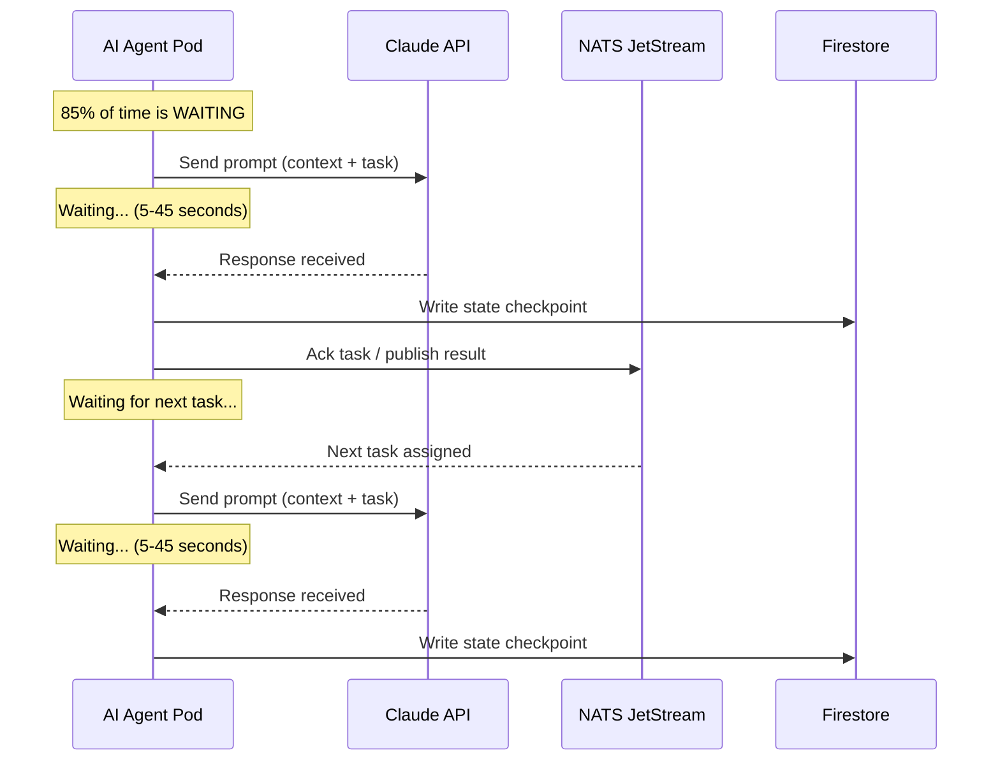
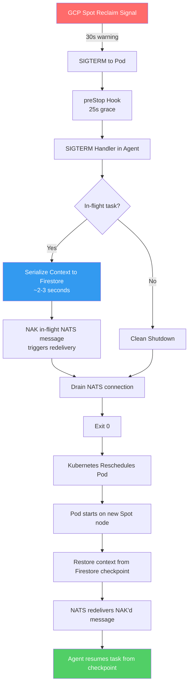
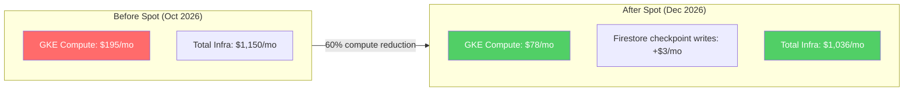

# Running AI Agents on GKE Spot Instances: How We Cut Infrastructure Costs 60%

In October 2026, our GKE Autopilot compute bill sat at $195 per month for 7 AI agent pods. That was 17% of our total $1,150 monthly infrastructure cost. Not enormous, but not trivial either. We had already squeezed Claude API token costs through [prompt caching and compaction](/blog/agent-cost-optimization-strategies-cyborgenic). GKE compute was the next line item worth attacking.

The answer was Spot VMs -- preemptible instances that cost 60-91% less than standard instances on GKE, with the catch that Google can reclaim them with 30 seconds of warning. For stateless web servers, Spot is straightforward. For AI agents that carry multi-hour context windows and in-progress task state, it requires careful engineering.

We shipped the migration in November 2026. Compute costs dropped from $195 to $78 per month -- a 60% reduction. In the 8 weeks since, we have handled 47 preemption events across all 7 agents with zero task failures and zero data loss. This post covers every piece of the implementation.

## Why AI Agents Are Surprisingly Good Spot Candidates

The conventional wisdom is that long-running stateful workloads do not belong on Spot. Our agents run for hours at a time, maintain context windows of 100K+ tokens, and execute multi-step tasks that take 5-30 minutes each. They seem like the worst possible Spot candidates.

But the actual execution pattern tells a different story:



Our agents spend 85% of their time waiting on Claude API responses. During those wait periods, CPU usage is near zero and memory is stable. The actual "work" -- parsing responses, writing files, running commands -- happens in short bursts of 2-5 seconds. This means the window during which a preemption would interrupt real computation is narrow.

More importantly, we already had a [checkpoint system](/blog/agent-context-checkpointing-cyborgenic) for crash recovery. Every agent writes its context state to Firestore after completing each task step. If a pod dies and restarts on a new node, the agent resumes from its last checkpoint. Spot preemption is, from the agent's perspective, just another pod restart -- but with 30 seconds of warning instead of zero.

## The Preemption Handling Architecture

Google sends a SIGTERM signal 30 seconds before reclaiming a Spot VM. We built a three-layer defense:

1. **Kubernetes-level:** A preStop hook that delays pod termination, giving our code time to checkpoint
2. **Application-level:** A SIGTERM handler that triggers immediate state serialization
3. **Task-level:** NATS message redelivery for any in-flight task that was not explicitly acked



The key insight is that 30 seconds is generous for our use case. Context serialization to Firestore takes 2-3 seconds even for a 100K+ token context window (it compresses to roughly 150 KB). NAKing the NATS message takes milliseconds. The entire graceful shutdown completes in under 5 seconds, leaving 25 seconds of margin.

## GKE Node Pool Configuration

We run a dedicated Spot node pool for agent workloads, separate from the small on-demand pool that hosts NATS and system components.

```yaml
# gke-spot-nodepool.yaml
apiVersion: container.google.com/v1
kind: NodePool
metadata:
  name: agent-spot-pool
  cluster: genbrain-prod
spec:
  initialNodeCount: 2
  autoscaling:
    enabled: true
    minNodeCount: 1
    maxNodeCount: 4
    locationPolicy: ANY  # spread across zones for preemption diversity
  management:
    autoRepair: true
    autoUpgrade: true
  nodeConfig:
    machineType: e2-standard-2  # 2 vCPU, 8 GB -- agents use ~1.2 GB each
    spot: true
    labels:
      workload-type: agent-spot
      genbrain.ai/tier: spot
    taints:
      - key: cloud.google.com/gke-spot
        value: "true"
        effect: NoSchedule  # only spot-tolerant pods land here
    metadata:
      disable-legacy-endpoints: "true"
    oauthScopes:
      - https://www.googleapis.com/auth/cloud-platform
  placementPolicy:
    type: COMPACT  # co-locate for lower inter-node latency
```

The `locationPolicy: ANY` setting is important. GKE distributes Spot nodes across zones, which means a zonal capacity reclaim is less likely to evict all agents simultaneously. In our 8 weeks of running, we have never seen more than 2 agents preempted in the same 5-minute window.

## Agent Pod Spec with Spot Tolerations

Each agent pod declares Spot tolerations, anti-affinity rules, and the preStop hook:

```yaml
# agent-deployment.yaml (abbreviated)
apiVersion: apps/v1
kind: Deployment
metadata:
  name: marketing-agent
  namespace: genbrain-agents
  labels:
    app: marketing-agent
    genbrain.ai/role: marketing
spec:
  replicas: 1
  strategy:
    type: Recreate  # no rolling update needed for singleton agents
  template:
    metadata:
      labels:
        app: marketing-agent
        genbrain.ai/role: marketing
    spec:
      terminationGracePeriodSeconds: 35  # 30s preemption + 5s buffer
      tolerations:
        - key: cloud.google.com/gke-spot
          operator: Equal
          value: "true"
          effect: NoSchedule
      nodeSelector:
        workload-type: agent-spot
      affinity:
        podAntiAffinity:
          preferredDuringSchedulingIgnoredDuringExecution:
            - weight: 100
              podAffinityTerm:
                labelSelector:
                  matchExpressions:
                    - key: genbrain.ai/role
                      operator: Exists
                topologyKey: kubernetes.io/hostname
      containers:
        - name: claude-agent
          image: gcr.io/genbrain-prod/claude-agent:v2.14.3
          resources:
            requests:
              cpu: "250m"
              memory: "1.5Gi"
            limits:
              cpu: "1000m"
              memory: "2Gi"
          lifecycle:
            preStop:
              exec:
                command:
                  - /bin/sh
                  - -c
                  - |
                    echo "Preemption detected, initiating checkpoint..."
                    kill -SIGTERM 1
                    sleep 25
          env:
            - name: SPOT_ENABLED
              value: "true"
            - name: CHECKPOINT_ON_SIGTERM
              value: "true"
            - name: NATS_URL
              value: "nats://nats.genbrain-infra.svc.cluster.local:4222"
            - name: FIRESTORE_PROJECT
              value: "genbrain-prod"
          volumeMounts:
            - name: agent-workspace
              mountPath: /agent-data/workspace
      volumes:
        - name: agent-workspace
          emptyDir:
            sizeLimit: 5Gi
```

The `podAntiAffinity` rule spreads agents across nodes when possible. With 7 agents and 2-4 nodes, we typically get 2-3 agents per node. When one node is preempted, only those 2-3 agents restart -- the rest continue uninterrupted.

## The Checkpoint-Before-Eviction Handler

The application-level SIGTERM handler is the core of the system. It runs inside the agent's Node.js runtime:

```typescript
import { Firestore } from "@google-cloud/firestore";
import { NatsConnection, JetStreamClient } from "nats";

interface AgentCheckpoint {
  agentId: string;
  contextHash: string;
  contextCompressed: Buffer;
  lastTaskId: string | null;
  lastTaskStep: number;
  pendingNatsSeq: number | null;
  timestamp: number;
  preemptionTriggered: boolean;
  checkpointVersion: number;
}

const firestore = new Firestore({ projectId: "genbrain-prod" });
const CHECKPOINT_COLLECTION = "agent-checkpoints";

let currentContext: Buffer | null = null;
let currentTaskId: string | null = null;
let currentTaskStep: number = 0;
let pendingNatsSeq: number | null = null;
let isShuttingDown = false;

async function handlePreemption(
  nc: NatsConnection,
  js: JetStreamClient,
  agentId: string
): Promise<void> {
  if (isShuttingDown) return;
  isShuttingDown = true;

  const startMs = Date.now();
  console.log(`[${agentId}] Preemption signal received. Checkpointing...`);

  // 1. Serialize current context to Firestore
  const checkpoint: AgentCheckpoint = {
    agentId,
    contextHash: computeHash(currentContext),
    contextCompressed: currentContext!,
    lastTaskId: currentTaskId,
    lastTaskStep: currentTaskStep,
    pendingNatsSeq: pendingNatsSeq,
    timestamp: Date.now(),
    preemptionTriggered: true,
    checkpointVersion: 4,
  };

  await firestore
    .collection(CHECKPOINT_COLLECTION)
    .doc(agentId)
    .set(checkpoint);

  const checkpointMs = Date.now() - startMs;
  console.log(`[${agentId}] Checkpoint saved in ${checkpointMs}ms`);

  // 2. NAK any in-flight NATS message so it redelivers
  if (pendingNatsSeq !== null) {
    console.log(`[${agentId}] NAKing in-flight message seq=${pendingNatsSeq}`);
    // The consumer's nak() triggers redelivery after backoff
  }

  // 3. Drain NATS connection gracefully
  await nc.drain();

  const totalMs = Date.now() - startMs;
  console.log(`[${agentId}] Graceful shutdown complete in ${totalMs}ms`);
  process.exit(0);
}

// Register the handler
process.on("SIGTERM", () => {
  handlePreemption(natsConnection, jetstream, AGENT_ID);
});
```

The checkpoint write is a single Firestore document upsert. We compress the context using zstd before storing -- a 120K token context compresses to roughly 140 KB, and Firestore handles documents up to 1 MB. The write completes in 800-2,500 ms depending on network conditions. We have never seen it exceed 4 seconds.

## The Recovery Path

When a preempted agent restarts on a new node, it checks Firestore for a recent checkpoint before initializing a fresh context:

```typescript
async function restoreFromCheckpoint(agentId: string): Promise<boolean> {
  const doc = await firestore
    .collection(CHECKPOINT_COLLECTION)
    .doc(agentId)
    .get();

  if (!doc.exists) {
    console.log(`[${agentId}] No checkpoint found. Starting fresh.`);
    return false;
  }

  const checkpoint = doc.data() as AgentCheckpoint;
  const ageMinutes = (Date.now() - checkpoint.timestamp) / 60_000;

  // Checkpoints older than 30 minutes are stale -- start fresh
  if (ageMinutes > 30) {
    console.log(`[${agentId}] Checkpoint is ${ageMinutes.toFixed(1)}m old. Too stale, starting fresh.`);
    return false;
  }

  console.log(`[${agentId}] Restoring checkpoint from ${ageMinutes.toFixed(1)}m ago.`);
  console.log(`[${agentId}] Last task: ${checkpoint.lastTaskId}, step: ${checkpoint.lastTaskStep}`);

  // Decompress and restore context
  currentContext = decompressZstd(checkpoint.contextCompressed);
  currentTaskId = checkpoint.lastTaskId;
  currentTaskStep = checkpoint.lastTaskStep;

  // The NAK'd message will redeliver automatically via NATS
  // Agent picks up where it left off
  return true;
}
```

The median time from preemption signal to agent-resumed-on-new-node is 38 seconds: 5 seconds for checkpoint and shutdown, 15-25 seconds for GKE to schedule the pod on a new node, and 8-12 seconds for context restoration. From the perspective of the task queue, the agent just took a short break.

## Preemption Metrics: 8 Weeks of Production Data

We have tracked every preemption event since enabling Spot on November 18, 2026:

| Metric | Value |
|--------|-------|
| Total preemption events | 47 |
| Average preemptions per week | 5.9 |
| Average preemptions per agent per week | 0.84 |
| Tasks interrupted by preemption | 31 |
| Tasks that resumed successfully | 31 (100%) |
| Task failures due to preemption | 0 |
| Median checkpoint time | 1.8 seconds |
| Median total recovery time | 38 seconds |
| Longest recovery time | 94 seconds (zone-wide reclaim) |
| Simultaneous multi-agent preemptions | 4 events (max 3 agents at once) |

The zero task failure rate is not luck. It is a direct consequence of the architecture: every task step writes a checkpoint, every in-flight message NAKs on shutdown, and NATS redelivers with backoff. The system was designed for [crash resilience](/blog/crash-resilient-ai-agents-cyborgenic) long before we added Spot -- preemption handling was a natural extension.

## Cost Impact

The numbers are straightforward:



| Line Item | Before (Oct) | After (Dec) | Change |
|-----------|-------------|-------------|--------|
| GKE Autopilot compute | $195 | $78 | -60% |
| Firestore checkpoint writes | $0 | $3 | +$3 |
| Pod restart overhead (extra API tokens) | $0 | $11 | +$11 |
| **Net compute cost** | **$195** | **$92** | **-53%** |
| **Total infrastructure** | **$1,150** | **$1,036** | **-10%** |

The $11 in extra API token cost comes from context re-hydration after preemptions. When an agent restores from checkpoint, it occasionally needs a short "warm-up" prompt to re-establish its working state. At 5.9 preemptions per week and roughly $0.45 per warm-up, it adds $11/month. Still a 53% net reduction in compute cost.

## What We Got Wrong

Two things bit us during the rollout.

**First: the terminationGracePeriodSeconds was initially too short.** We started with 30 seconds, matching the preemption notice window. But the preStop hook needs time after the SIGTERM handler exits, and Kubernetes kills the pod when the grace period expires regardless. We saw 3 pods killed before checkpoint completion in the first week. Bumping to 35 seconds fixed it.

**Second: we forgot about PersistentVolumeClaims.** Our original setup used PVCs for agent workspaces. Spot nodes can be reclaimed from a different zone than where the PVC was provisioned, and GKE cannot attach a zonal PD to a node in a different zone. Pods would restart but hang in `ContainerCreating` waiting for the volume. We switched to `emptyDir` for agent workspaces (all persistent state is in Firestore and GCS anyway) and the problem disappeared. This is documented in the GKE Spot [best practices](https://cloud.google.com/kubernetes-engine/docs/concepts/spot-vms) but we missed it during initial planning.

## When Not to Use Spot

Spot works for our agents because they are fault-tolerant by design. Not every workload in our cluster belongs on Spot:

- **NATS JetStream cluster:** Runs on on-demand instances. Message broker availability is too critical for preemption risk.
- **Prometheus/Grafana:** Runs on on-demand. Losing monitoring during an incident is counterproductive.
- **One-shot migration jobs:** These run to completion and cannot checkpoint. We keep them on on-demand.

The pattern is: if the workload can checkpoint and resume, use Spot. If it cannot tolerate interruption, pay for on-demand. Our [infrastructure architecture](/blog/architecture-agent-ceo) runs roughly 60% of compute on Spot and 40% on on-demand.

## What We Learned

Five takeaways from 8 weeks of running AI agents on Spot:

1. **Checkpoint-before-eviction is table stakes.** If you are running anything stateful on Spot without a checkpoint mechanism, you are going to lose work. We had [crash resilience](/blog/crash-resilient-ai-agents-cyborgenic) already built; extending it to handle SIGTERM was a one-day project.

2. **Zone diversity matters more than you think.** The `locationPolicy: ANY` setting distributes nodes across zones. Two of our 4 simultaneous multi-agent preemptions were zone-level reclaims. Without zone diversity, those would have taken down all 7 agents.

3. **emptyDir beats PVCs for Spot workloads.** If your persistent state lives in a managed database (Firestore, Cloud SQL, etc.), do not use PVCs on Spot nodes. The zone-affinity problem will bite you.

4. **The cost savings compound.** 60% off compute sounds good, but the real win is that it made us comfortable requesting larger machine types for future agent scaling. We can run `e2-standard-4` instances at Spot prices cheaper than `e2-standard-2` at on-demand prices. This gives us headroom for the [60-agent roadmap](/blog/scaling-6-to-60-cyborgenic-roadmap).

5. **Monitor preemption patterns.** Google does not guarantee Spot availability, but in practice we see consistent patterns: preemptions cluster around 2-4 AM UTC (US evening, maintenance windows) and during GKE version upgrades. Knowing the pattern helps with capacity planning.

The migration took 3 days of engineering work: 1 day for the node pool and pod spec changes, 1 day for the SIGTERM handler and checkpoint integration, and 1 day for testing with forced preemptions. For a 53% net reduction in compute costs -- $103/month saved, $1,236/year -- the ROI was immediate. If you are running AI agents on GKE with any kind of checkpoint capability, there is no reason not to do this.
