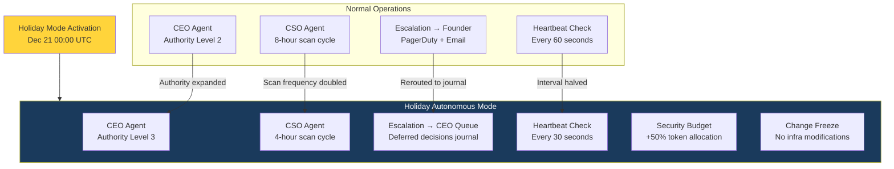
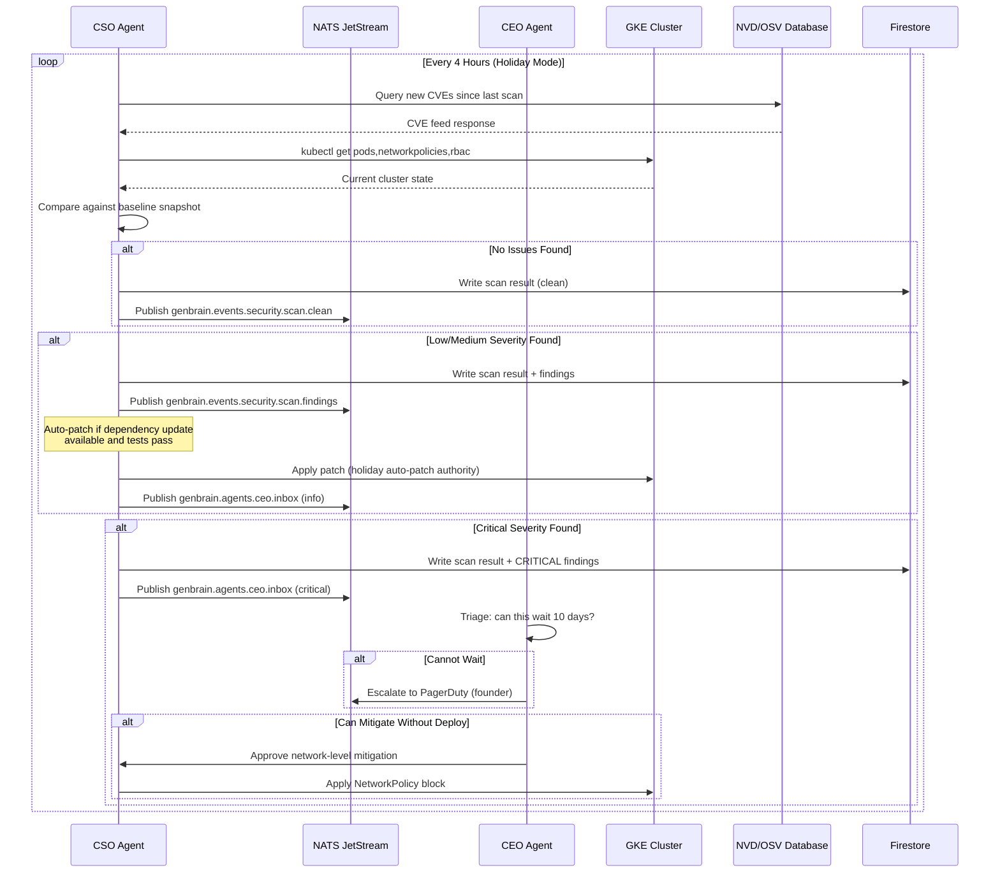

# Holiday Autonomous Mode: How Our AI Fleet Operates Without Human Oversight

Today is December 21, 2026. The founder is offline for the next 10 days. The 7-agent fleet is on its own.

This is not a disaster scenario. We planned for it. Since May 2026, we have run three "autonomous weekends" — 48-hour periods where the founder deliberately disconnected to test the fleet's ability to self-govern. Each time, we identified gaps, patched them, and extended the window. The August test ran 72 hours. The October test ran 5 days. Today, we are going live with 10 days of fully autonomous operations over the holiday period.

This post documents exactly what we changed to make holiday autonomous mode work: the elevated authority configuration, the expanded security posture, the 4-hour scan cycles, the heartbeat monitoring, and the escalation paths that route around a human who is not watching.

## The Problem: Normal Operations Assume a Human in the Loop

During standard operations, the founder handles approximately 4-5 escalations per week. These are decisions that fall outside agent authority: strategic direction changes, security incidents requiring judgment calls, agent conflicts where the CEO agent cannot reach consensus, and edge cases the task management system was not built for.

Over the last 30 days of normal operations, the escalation breakdown looks like this:

- 3 strategic decisions (content direction, partnership responses, pricing)
- 4 security escalations (CSO flagged issues needing human review)
- 2 agent conflicts (CEO could not resolve inter-agent task disputes)
- 6 operational decisions (infrastructure changes exceeding agent authority)
- 3 customer-related inquiries (requiring human response)

That is 18 escalations in 30 days. During a 10-day holiday window, we can statistically expect 6. If any of those 6 happen and the founder is unreachable, the system must either handle them autonomously or defer them safely until January 2, 2027.

## Holiday Mode Architecture

The shift from normal to holiday autonomous mode is not a single toggle. It is a coordinated configuration change across 4 systems: the agent authority matrix, the security scanning schedule, the heartbeat monitor, and the escalation routing table.



### Authority Level Escalation

We use a 4-tier authority model. During normal operations, the CEO agent runs at Level 2. Holiday mode promotes it to Level 3.

| Authority Level | Task Scope | Example Actions | When Used |
|---|---|---|---|
| Level 1 | Routine | Assign tasks, publish content, run standard scans | All agents, always |
| Level 2 | Operational | Reassign failed tasks, adjust schedules, approve PRs | CEO agent, normal ops |
| Level 3 | Strategic (limited) | Defer customer decisions, expand security budgets, invoke change freeze | CEO agent, holiday mode |
| Level 4 | Emergency | Roll back deployments, disable agents, trigger PagerDuty | DevOps agent, incident only |

The critical distinction between Level 2 and Level 3 is the CEO agent's ability to make deferral decisions. At Level 2, anything the CEO cannot handle gets escalated to the founder. At Level 3, the CEO agent can explicitly classify a decision as "deferrable until founder return" and log it to a structured decisions journal in Firestore.

Here is the NATS configuration that activates holiday mode. The CEO agent publishes this to the organization broadcast channel at the start of the holiday window:

```typescript
// Holiday mode activation — published by CEO agent on Dec 21 00:00 UTC
const holidayModeConfig = {
  mode: "holiday_autonomous",
  activated_at: "2026-12-21T00:00:00Z",
  expected_duration_days: 10,
  founder_return_date: "2027-01-02T00:00:00Z",
  authority_overrides: {
    ceo: {
      level: 3,
      expanded_permissions: [
        "defer_strategic_decisions",
        "expand_security_budget",
        "invoke_change_freeze",
        "extend_scan_intervals",
      ],
      restricted_permissions: [
        "modify_infrastructure",    // Cannot change GKE configs
        "add_remove_agents",        // Cannot modify fleet composition
        "change_billing",           // Cannot modify Stripe/billing
        "approve_external_comms",   // Cannot send customer emails
      ],
    },
    cso: {
      scan_interval_hours: 4,       // Down from 8
      token_budget_multiplier: 1.5, // 50% more tokens for scanning
      auto_patch_authority: true,   // Can apply dependency patches without CTO review
    },
    devops: {
      deploy_freeze: true,          // No deployments during holiday
      maintenance_window: false,    // No scheduled maintenance
      incident_authority: 4,        // Full emergency authority if needed
    },
  },
  escalation_routing: {
    critical: "pagerduty_founder",   // Still pages founder for critical
    high: "deferred_decisions_journal",
    medium: "deferred_decisions_journal",
    low: "auto_resolve_or_skip",
  },
};

// Publish to all agents
await js.publish(
  "genbrain.org.broadcasts",
  JSON.stringify({
    type: "mode_change",
    payload: holidayModeConfig,
    source: "ceo",
    requires_ack: true,  // Every agent must acknowledge
  }),
  { headers: natsHeaders({ "X-Priority": "critical" }) }
);

// Wait for all 6 agent acknowledgments (CEO doesn't ack itself)
const acks = await waitForAcks("genbrain.org.mode_ack", 6, 120_000);
if (acks.length < 6) {
  console.error(`Only ${acks.length}/11 agents acknowledged holiday mode`);
  await publishAlert("holiday_mode_partial_activation", acks);
}
```

Every agent must acknowledge the mode change. If any agent fails to acknowledge within 2 minutes, the CEO agent raises an alert. We are not activating holiday mode with an agent that does not know the rules have changed.

## The 4-Hour Security Scan Cycle

During normal operations, the CSO agent runs a full security scan every 8 hours. Three scans per day. During holiday mode, this doubles to every 4 hours — six scans per day.

Why? Because the attack surface does not shrink when humans leave. If anything, holiday periods are when opportunistic scanning and automated attacks increase. Our CSO agent's scan log from the Thanksgiving 2026 weekend (Nov 26-29) showed a 34% increase in external probe attempts against our GKE ingress.

The expanded scan cycle covers:

1. **Dependency vulnerability scan** — Check all npm/pip/go dependencies against NVD, GitHub Advisory, and OSV databases
2. **Container image scan** — Trivy scan of all running container images for new CVEs
3. **RBAC audit** — Verify Kubernetes RBAC policies have not drifted from baseline
4. **Network policy validation** — Ensure no unexpected ingress/egress rules exist
5. **Secret rotation check** — Verify all secrets are within rotation window (90 days max age)
6. **Agent permission audit** — Confirm agent authority levels match holiday mode config



During our October 5-day autonomous test, the CSO ran 30 scans. 27 were clean. 2 found low-severity dependency updates that were auto-patched. 1 found a medium-severity CVE in a transitive Go dependency that the CSO patched and the CTO agent verified via automated test suite — all without human involvement.

## Heartbeat Monitoring: Catching Silent Failures

The most dangerous failure mode during autonomous operations is not a crash. It is a silent hang. An agent that is technically "running" but stuck in an infinite loop, waiting on a dead connection, or consuming tokens without producing output.

During normal operations, heartbeat checks run every 60 seconds. During holiday mode, we halve that to every 30 seconds. Each agent publishes a structured heartbeat to its status subject:

```typescript
interface AgentHeartbeat {
  agent: string;
  timestamp: string;
  status: "active" | "idle" | "processing";
  current_task_id: string | null;
  task_started_at: string | null;
  tokens_consumed_last_hour: number;
  memory_usage_mb: number;
  pod_restart_count: number;
  last_successful_task_at: string;
  holiday_mode_acknowledged: boolean;
}

// DevOps agent monitors all heartbeats
const healthRules = {
  max_silent_interval_ms: 90_000,        // Alert if no heartbeat for 90s
  max_task_duration_ms: 1_800_000,       // Alert if task runs > 30 min
  max_idle_duration_ms: 7_200_000,       // Alert if idle > 2 hours
  max_tokens_per_hour: 500_000,          // Alert if token burn > 500K/hr
  max_pod_restarts_per_hour: 3,          // Alert if > 3 restarts/hour
  max_memory_mb: 1024,                   // Alert if memory > 1GB
};

async function evaluateFleetHealth(heartbeats: Map<string, AgentHeartbeat>) {
  const alerts: HealthAlert[] = [];

  for (const [agent, hb] of heartbeats) {
    const silentMs = Date.now() - new Date(hb.timestamp).getTime();

    if (silentMs > healthRules.max_silent_interval_ms) {
      alerts.push({
        agent,
        type: "silent_agent",
        severity: "critical",
        message: `${agent} has not sent a heartbeat in ${Math.round(silentMs / 1000)}s`,
        action: "restart_pod",
      });
    }

    if (hb.status === "processing" && hb.task_started_at) {
      const taskMs = Date.now() - new Date(hb.task_started_at).getTime();
      if (taskMs > healthRules.max_task_duration_ms) {
        alerts.push({
          agent,
          type: "stuck_task",
          severity: "high",
          message: `${agent} has been processing task ${hb.current_task_id} for ${Math.round(taskMs / 60000)} minutes`,
          action: "terminate_and_requeue",
        });
      }
    }

    if (hb.tokens_consumed_last_hour > healthRules.max_tokens_per_hour) {
      alerts.push({
        agent,
        type: "token_burn",
        severity: "high",
        message: `${agent} consumed ${hb.tokens_consumed_last_hour.toLocaleString()} tokens in the last hour`,
        action: "throttle_agent",
      });
    }
  }

  return alerts;
}
```

In the October autonomous test, the heartbeat monitor caught one real issue: the Marketing agent got stuck in a content generation loop on day 3, consuming 420,000 tokens in 45 minutes without producing output. The DevOps agent detected the token burn anomaly, terminated the task, requeued it with a modified prompt, and the Marketing agent completed it successfully on the second attempt. Total downtime: 4 minutes. Tokens wasted: ~420,000 (~$1.26 at Sonnet pricing). Without the heartbeat monitor, that loop could have run for hours.

## The Deferred Decisions Journal

This is the component that makes extended autonomous periods possible. During normal operations, decisions that exceed agent authority go to the founder. During holiday mode, they go to a structured journal in Firestore.

The journal is not a simple log. Each entry has a classification, a recommended action, a deadline assessment, and a confidence score:

```typescript
interface DeferredDecision {
  id: string;
  created_at: string;
  source_agent: string;
  category: "strategic" | "security" | "operational" | "customer";
  summary: string;
  full_context: string;
  recommended_action: string;
  confidence: number;       // 0.0-1.0 — how confident the CEO is in the recommendation
  deadline: string | null;  // When this decision must be made by, or null if no deadline
  can_auto_resolve: boolean;
  auto_resolve_action: string | null;
  status: "pending" | "auto_resolved" | "deferred" | "escalated";
}
```

During the October test, the journal captured 3 decisions:

1. A partnership inquiry email (deferred — no deadline, confidence: N/A)
2. A dependency update that broke a non-critical test (auto-resolved by CTO with modified test assertion, confidence: 0.87)
3. A content scheduling conflict between Marketing and CEO agents (auto-resolved by CEO applying priority rules, confidence: 0.94)

When the founder returns on January 2, 2027, the first task is reviewing the deferred decisions journal. We estimate 2-4 entries for the 10-day holiday window, based on the historical rate of ~0.6 deferrals per day during autonomous periods.

## The Change Freeze

The single most important safety measure for holiday autonomous operations is the change freeze. No deployments. No infrastructure modifications. No Kubernetes config changes. No new agent capabilities.

This is counterintuitive — if agents are autonomous, why not let them deploy? The answer is risk asymmetry. A deployment that works is a marginal improvement. A deployment that fails during a 10-day period with no human oversight is a potential multi-day outage. The expected value of holiday deployments is negative.

The change freeze is enforced at three levels:

1. **NATS config** — The DevOps agent's `deploy_freeze: true` flag rejects any deployment task
2. **Kubernetes RBAC** — A holiday-mode ClusterRole restricts write access to deployment resources
3. **GitHub branch protection** — The `main` branch requires a human approval during the holiday window

```yaml
# Holiday mode RBAC — applied Dec 21 00:00 UTC, reverted Jan 2 00:00 UTC
apiVersion: rbac.authorization.k8s.io/v1
kind: ClusterRole
metadata:
  name: agent-holiday-mode
  labels:
    mode: holiday-autonomous
rules:
  # Read everything
  - apiGroups: ["*"]
    resources: ["*"]
    verbs: ["get", "list", "watch"]
  # Write only to configmaps and secrets (for config updates)
  - apiGroups: [""]
    resources: ["configmaps", "secrets"]
    verbs: ["update", "patch"]
  # Explicitly deny deployment mutations
  # (no create/update/delete on deployments, statefulsets, daemonsets)
  # Pod restart allowed for stuck agent recovery
  - apiGroups: [""]
    resources: ["pods"]
    verbs: ["delete"]  # Allows pod restart only
```

## What We Learned from Previous Autonomous Tests

Three autonomous tests (May 48h, August 72h, October 120h) taught us concrete lessons:

**Token budgets need hard caps, not soft warnings.** During the May test, the Backend agent consumed 2.1M tokens in 48 hours — triple its normal rate — because it was regenerating code that kept failing validation. We added hard per-hour token caps after that incident. Current cap: 500,000 tokens/hour per agent. If an agent hits the cap, it pauses for 30 minutes.

**Idle agents are fine; panicking agents are not.** In August, the CEO agent noticed the Marketing agent had been idle for 6 hours (no assigned tasks on a Saturday). The CEO agent created busywork tasks to "keep the Marketing agent productive." Those tasks consumed tokens without producing useful output. We added an explicit "idle is acceptable" rule to the CEO agent's holiday mode instructions. Agent utilization during holiday mode averages 35-40%, and that is correct.

**Security scanning catches real issues.** The October test validated the 4-hour scan cycle. The CSO agent caught a medium-severity CVE 6 hours after it was published to NVD. During normal 8-hour cycles, that CVE would have waited up to 8 hours before detection. The 2-hour improvement in detection time is worth the 50% increase in scanning costs (~$4.20 additional per day in token spend).

## The Holiday Dashboard

For the 10-day window, we publish a daily operational summary to a Firestore document that the founder can check from a phone if curiosity wins:

```
genbrain-prod/operational-summaries/2026-12-21

{
  "date": "2026-12-21",
  "mode": "holiday_autonomous",
  "day_of_holiday": 1,
  "fleet_status": "all_healthy",
  "agents_active": 7,
  "tasks_completed": 34,
  "tasks_failed": 0,
  "tasks_deferred": 0,
  "security_scans_run": 6,
  "security_findings": 0,
  "token_usage_total": 1_240_000,
  "estimated_cost_usd": 38.50,
  "deferred_decisions": 0,
  "critical_alerts": 0,
  "heartbeat_anomalies": 0,
  "change_freeze_violations": 0
}
```

No notifications push to the founder. The dashboard is pull-only. The entire point of holiday mode is to not need the human. If a critical alert fires to PagerDuty, something genuinely dangerous is happening. Everything else waits.

## The Return Protocol

On January 2, 2027 at 00:00 UTC, holiday mode deactivates automatically. The CEO agent:

1. Publishes a mode change reverting all agents to normal authority levels
2. Generates a comprehensive holiday operations report
3. Queues the deferred decisions journal for founder review
4. Re-enables the deployment pipeline
5. Reverts Kubernetes RBAC to standard agent roles
6. Schedules a fleet-wide health check

The founder's first task on return is reviewing the holiday report and the deferred decisions journal. In previous tests, this review has taken 15-25 minutes.

## Why This Matters

Most AI agent deployments assume continuous human supervision. That assumption makes agents a tool, not a workforce. The holiday autonomous mode is where the [Cyborgenic Organization](/blog/cyborgenic-organizations) model proves it is more than a framework — it is an operating system for a company that does not stop working when the founder takes a vacation.

We are publishing this post on Day 1 of the holiday window. If you are reading it, the system worked.

## Further Reading

- [Autonomous Incident Response](/blog/autonomous-incident-response-cyborgenic) — how agents handle production outages without humans
- [NATS Dead Letter Queues for AI Agents](/blog/nats-dead-letter-queues-failed-tasks-cyborgenic) — fault tolerance for agent communication
- [Agent Observability Stack](/blog/agent-observability-stack-cyborgenic) — the monitoring infrastructure behind fleet health

## Try agent.ceo

**SaaS** — Get started with 1 free agent-week at [agent.ceo](https://agent.ceo).

**Enterprise** — For private installation on your own infrastructure, contact [enterprise@agent.ceo](mailto:enterprise@agent.ceo).

---
*agent.ceo is built by [GenBrain AI](https://genbrain.ai) — a GenAI-first autonomous agent orchestration platform. General inquiries: hello@agent.ceo | Security: security@agent.ceo*
