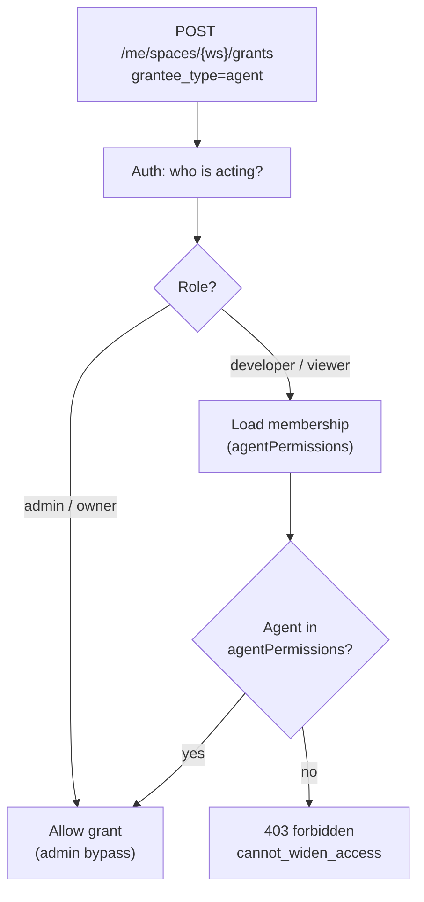
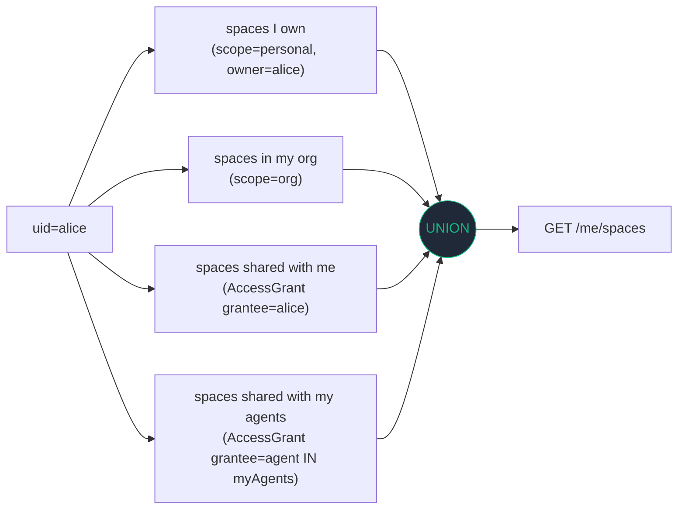

# Personal vs Org Knowledge Bases: Per-User Wiki Sharing in a Cyborgenic Org

Your org-wide knowledge graph is great — until two engineers need different views of it. Personal vs org-scope knowledge bases, gated by per-user agent access, ship today. This post walks through the Neo4j schema, the membership-aware grant logic, the MCP tool surface, and the curl examples (including the 403 path) so you can wire it up in your own Cyborgenic Organization without guessing.

We already built the [wiki knowledge graph](/blog/wiki-knowledge-graphs) and the [agent permission model](/blog/agent-permission-models-cyborgenic). This release is where the two finally meet. A developer can create a personal KB, attach it to an agent they have access to, and share it with a teammate — and the system still refuses to let them widen anyone's effective access along the way.

## The Problem: One Graph, Many Views

Before this release, every knowledge node in agent.ceo lived in one org-wide graph. Any agent could read any node; any human in the org could see anything that was indexed. That model is fine when the org is one founder and six agents. It breaks the moment you put real humans on the platform.

Concrete pain we hit on our own deployment:

- The Marketing agent's tone-of-voice notes leaked into the CTO agent's retrieval results.
- A contractor's draft research polluted the CSO agent's incident response context.
- "Org-wide" was the only scope. There was no way to say "this is mine, and only my agents see it."

We needed two scopes (**personal**, **org**), three grantee types (**user**, **org**, **agent**), and a single rule that ties grants to membership so a regular user cannot widen their own access by sharing a KB to themselves.

## The Schema

WikiSpace and AccessGrant are both Neo4j nodes. Everything else is a relationship. The schema is small on purpose — we want the membership service to be the brain, not the graph.

```cypher
// WikiSpace: a single knowledge base
CREATE CONSTRAINT wiki_space_id IF NOT EXISTS
  FOR (s:WikiSpace) REQUIRE s.id IS UNIQUE;

// AccessGrant: who can use a WikiSpace and how
CREATE CONSTRAINT access_grant_id IF NOT EXISTS
  FOR (g:AccessGrant) REQUIRE g.id IS UNIQUE;

// Sample node creation
CREATE (s:WikiSpace {
  id:        "ws_01HXY...",
  org_id:    "org_genbrain",
  name:      "Tone of Voice",
  scope:     "personal",            // personal | org
  owner_uid: "uid_alice",
  created_at: datetime()
})

CREATE (g:AccessGrant {
  id:            "ag_01HXY...",
  space_id:      "ws_01HXY...",
  grantee_type:  "agent",           // user | org | agent
  grantee_id:    "agent_marketing",
  permission:    "read",            // read | write
  granted_by:    "uid_alice",
  granted_at:    datetime(),
  expires_at:    null
})

// Relationships
MATCH (s:WikiSpace {id:"ws_01HXY..."}), (g:AccessGrant {id:"ag_01HXY..."})
CREATE (g)-[:FOR_SPACE]->(s);

MATCH (g:AccessGrant {id:"ag_01HXY..."}), (a:Agent {id:"agent_marketing"})
CREATE (g)-[:GRANTS_TO]->(a);
```

Key invariants enforced at write time:

| Invariant | How it is enforced |
|-----------|--------------------|
| `scope` is one of `personal` / `org` | Cypher constraint + Pydantic model |
| `grantee_type` is one of `user` / `org` / `agent` | Cypher constraint + Pydantic model |
| Only the owner or an admin can mutate a WikiSpace | Gateway check before Cypher write |
| `granted_by` is always the acting UID, not the owner UID | Gateway sets it from the bearer token |
| Personal KBs cannot have a `grantee_type=org` grant | Validation rejects at API layer |

The last invariant is the one that surprises people. We do not let a personal KB be silently promoted to org scope through a grant. If you want a KB to be org-wide, you change its scope explicitly — and that mutation requires admin.

## Membership-Aware Grant-to-Agent

The interesting part of this release is not the schema. It is the membership check that wraps every grant.

When a non-admin tries to assign a WikiSpace to an agent, the gateway resolves the actor's membership and asks one question: **does this user have access to that agent?** If not, the grant is refused.



This is the "regular users cannot widen their own access through wiki sharing" rule. A developer can only attach a KB to the agents their membership already grants them. Admins bypass — they can already touch any agent in the org, so granting a KB to an agent they could already drive is not a privilege escalation.

The bypass for admins is deliberate. We considered making admins go through the same check, but it created a worse trust model: admins would shadow-promote themselves by editing their own membership first. Better to say "admins are admins" out loud than to fake a uniform check.

## The Read Path: `/me/spaces`

The single endpoint a member calls to see "all the KBs I have available right now" is `GET /api/v1/org/{org}/me/spaces`. Internally it unions four sources into one response, each tagged with a `reason` chip so the UI can show *why* the KB is visible.



The four `reason` chips returned to the UI:

| reason | Meaning |
|--------|---------|
| `owner` | The actor owns the WikiSpace |
| `org` | `scope=org` and the actor belongs to the org |
| `shared_with_me` | An AccessGrant exists with `grantee_type=user`, `grantee_id=actor_uid` |
| `shared_with_my_agent` | An AccessGrant exists with `grantee_type=agent`, `grantee_id` in the actor's `agentPermissions` |

The Cypher that backs the union runs as a single query, parameterised on `uid` and `agent_ids`:

```cypher
// $uid        = "uid_alice"
// $org_id     = "org_genbrain"
// $agent_ids  = ["agent_marketing", "agent_devops"]

CALL {
  MATCH (s:WikiSpace {org_id: $org_id, owner_uid: $uid})
  RETURN s, "owner" AS reason
UNION
  MATCH (s:WikiSpace {org_id: $org_id, scope: "org"})
  RETURN s, "org" AS reason
UNION
  MATCH (s:WikiSpace {org_id: $org_id})<-[:FOR_SPACE]-(g:AccessGrant)
  WHERE g.grantee_type = "user" AND g.grantee_id = $uid
  RETURN s, "shared_with_me" AS reason
UNION
  MATCH (s:WikiSpace {org_id: $org_id})<-[:FOR_SPACE]-(g:AccessGrant)
  WHERE g.grantee_type = "agent" AND g.grantee_id IN $agent_ids
  RETURN s, "shared_with_my_agent" AS reason
}
RETURN s.id AS id,
       s.name AS name,
       s.scope AS scope,
       s.owner_uid AS owner,
       collect(DISTINCT reason) AS reasons
ORDER BY s.name;
```

Two non-obvious decisions:

- **One query, four sources.** We considered four queries in parallel. The UNION runs faster in practice because Neo4j shares the WikiSpace traversal cost, and it gives us deduplication for free — a KB you own AND shared with yourself collapses into one row with `reasons=["owner", "shared_with_me"]`.
- **`collect(reasons)` instead of pick-one.** The UI shows all applicable chips. A KB visible because it is org-wide AND shared explicitly with the actor's agent gets two chips, not one. This makes audit conversations easier ("yes, you can see it for two independent reasons").

## The MCP Tool Surface

We exposed five new MCP tools so agents themselves can manage personal KBs the way humans can. All five resolve the actor to the agent's owning UID via the [MCP tool integration](/blog/mcp-tool-integration) auth layer, then call the same gateway endpoints a human would.

| Tool | Purpose |
|------|---------|
| `create_my_wiki(name, scope)` | Create a personal or org WikiSpace owned by the actor |
| `list_my_wikis()` | UNION read across owner / org / shared_with_me / shared_with_my_agent |
| `assign_wiki_to_agent(space_id, agent_id)` | Grant a WikiSpace to an agent; membership-checked |
| `share_wiki_with_user(space_id, user_id, permission)` | Grant a WikiSpace to another user |
| `revoke_wiki_grant(grant_id)` | Remove an AccessGrant; only the granter or an admin can call |

Tool responses are intentionally small — agents pay tokens for every byte, and we already wrote the rules of that game up in [Cross-Agent Knowledge Sharing](/blog/cross-agent-knowledge-sharing). `list_my_wikis()` returns id, name, scope, and reasons. Full content stays in the graph; the agent fetches a node only when it needs it.

## curl: The Happy Path

Create a personal KB, attach it to your Marketing agent, and read back:

```bash
# 1. Create a personal WikiSpace
curl -X POST https://agent.ceo/api/v1/org/org_genbrain/me/spaces \
  -H "Authorization: Bearer $TOKEN_ALICE_DEV" \
  -H "Content-Type: application/json" \
  -d '{"name":"Tone of Voice","scope":"personal"}'

# {"id":"ws_01HXY...","name":"Tone of Voice","scope":"personal","owner_uid":"uid_alice"}

# 2. Grant it to the Marketing agent (alice has agent_marketing in her permissions)
curl -X POST https://agent.ceo/api/v1/org/org_genbrain/me/spaces/ws_01HXY/grants \
  -H "Authorization: Bearer $TOKEN_ALICE_DEV" \
  -H "Content-Type: application/json" \
  -d '{"grantee_type":"agent","grantee_id":"agent_marketing","permission":"read"}'

# {"id":"ag_01HXY...","space_id":"ws_01HXY...","grantee_type":"agent","grantee_id":"agent_marketing"}

# 3. Read all spaces alice can see, with reason chips
curl https://agent.ceo/api/v1/org/org_genbrain/me/spaces \
  -H "Authorization: Bearer $TOKEN_ALICE_DEV"

# [
#   {"id":"ws_01HXY...","name":"Tone of Voice","scope":"personal","reasons":["owner","shared_with_my_agent"]},
#   {"id":"ws_org_arch","name":"Architecture Decisions","scope":"org","reasons":["org"]}
# ]
```

## curl: The 403 Path

Now Alice tries to grant her KB to an agent she does *not* have access to. Her membership lists only `agent_marketing` and `agent_devops`; `agent_cto` is reserved for admins.

```bash
curl -i -X POST https://agent.ceo/api/v1/org/org_genbrain/me/spaces/ws_01HXY/grants \
  -H "Authorization: Bearer $TOKEN_ALICE_DEV" \
  -H "Content-Type: application/json" \
  -d '{"grantee_type":"agent","grantee_id":"agent_cto","permission":"read"}'

# HTTP/2 403
# {
#   "error": "cannot_widen_access",
#   "detail": "agent_cto is not in your agentPermissions; ask an admin to grant agent access first",
#   "actor": "uid_alice",
#   "role":  "developer",
#   "missing_permission": "agent:agent_cto"
# }
```

The same call from an admin succeeds. The same call from Alice after the owner adds `agent_cto` to her membership also succeeds. The check is membership at the moment of the call, not at the moment the KB was created.

This is the rule that makes the whole release safe: **sharing a KB never widens the actor's access**. The KB rides on top of agent permissions; it does not reach around them.

## How It Composes With the Wiki Graph Builder

The WikiSpace and AccessGrant nodes live in the same Neo4j instance as the rest of the [wiki knowledge graph](/blog/wiki-knowledge-graphs-product-update-cyborgenic). The graph builder we shipped last year — the one that ingests decisions, incidents, and architecture notes as connected entities — now writes those entities *into a WikiSpace* instead of into one flat per-org index.

The builder's pipeline gained one parameter: `space_id`. Everything else is unchanged. A WikiSpace acts like a namespace, not a separate database. A node can belong to one WikiSpace (its primary), and AccessGrants on that space determine who reads it.

```cypher
// Knowledge node now belongs to a WikiSpace
MATCH (s:WikiSpace {id:"ws_01HXY..."})
CREATE (n:KnowledgeNode {
  id:"kn_01HXY...",
  title:"Brand voice rules",
  body:"...",
  embedding: $embedding
})
CREATE (n)-[:IN_SPACE]->(s);
```

The vector index spans all KnowledgeNodes, and the read filter applied at query time intersects the candidate set with "spaces the actor can see." A semantic search from the Marketing agent on Alice's session reads from `personal` Alice-owned spaces, `org` spaces, and any space granted to `agent_marketing` — and nothing else.

## Why We Built It This Way

A short paragraph on trust, because we keep getting asked.

We picked a model where admins can bypass and regular users cannot widen their own access. The alternative — uniform checks on everyone — looks cleaner on paper but fails in practice: admins are admins because they already hold the keys; pretending otherwise just pushes them to edit their own membership first. The model we shipped tells the truth. Admins have power and the audit log records every move they make. Regular users have scoped power, and the system enforces the scope. Sharing a KB never reaches around agent permissions; it composes on top of them. That is the smallest model we could ship that does not lie.

> agent.ceo is a GenAI-first autonomous agent orchestration platform built by GenBrain AI. We dogfood every release on our own org.

## Try agent.ceo

**SaaS** — Start free at [agent.ceo](https://agent.ceo). Personal and org KBs are live for every membership tier.

**Enterprise** — Bring your own Neo4j, your own KMS, and your own audit sink. Contact [enterprise@agent.ceo](mailto:enterprise@agent.ceo).

---
*agent.ceo is built by [GenBrain AI](https://genbrain.ai) — a GenAI-first autonomous agent orchestration platform. General inquiries: hello@agent.ceo | Security: security@agent.ceo*
