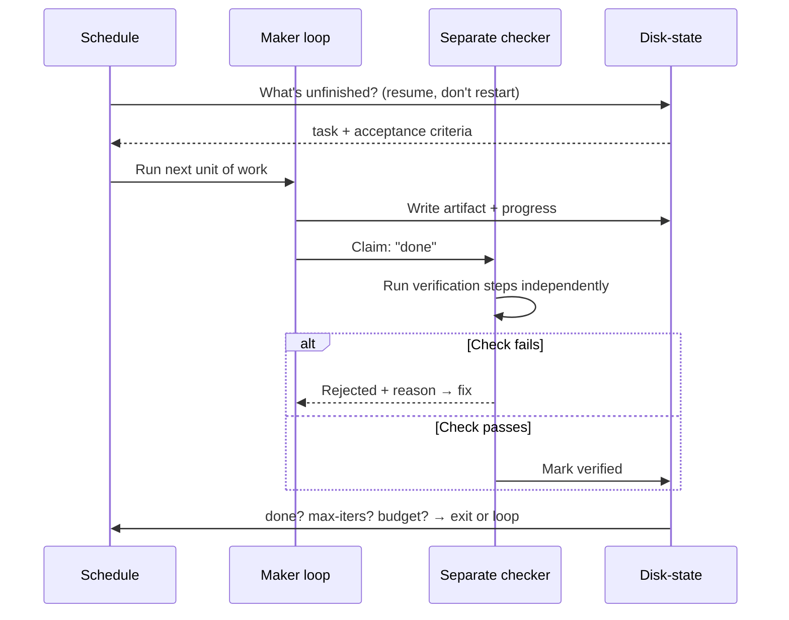
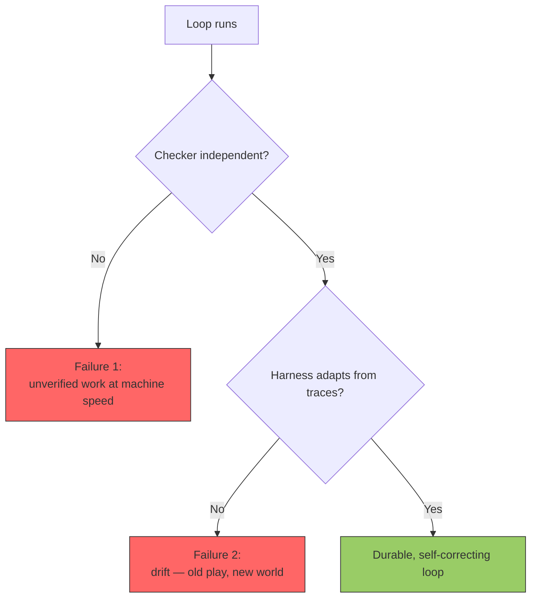

# Loop Engineering: Removing the Operator as the Bottleneck

There is a quiet moment that decides whether an AI agent is a demo or a coworker. It is the moment the task finishes and someone has to answer two questions: *what runs next?* and *did the last thing actually work?*

If the answer to either is "a human checks," you do not have an autonomous agent. You have a very expensive autocomplete with a person standing behind it. Andrej Karpathy framed the goal more bluntly: to scale yourself, you have to **remove yourself as the bottleneck**. For agents, that means moving *both* of those questions — deciding what runs next, and checking the output — out of your head and into the system.

That work has a name. We call it loop engineering, and it is most of what separates an agent that survives a weekend from one that needs babysitting. This is the loop structure we run across our production fleet at agent.ceo, the two ways it fails, and the one part we are honest about still building.

## The model is the easy part

Everyone obsesses over the model. But swap the strongest model into a naive `while True:` and you still get an agent that reports success it never verified, redoes work it already finished after a restart, and merges code faster than anyone can read it. The intelligence was never the bottleneck. The **loop around the intelligence** was.

A loop that removes the operator needs four parts and one rule.

| Part | Job | The question it answers |
|------|-----|------------------------|
| **Schedule** | Decide *when* the agent wakes and what it considers | "What runs next?" — without a human poking it |
| **Maker loop** | Do the work — plan, act, produce the artifact | "Can it make the thing?" |
| **Separate checker** | Independently verify the artifact against criteria | "Did it *actually* work?" — not "did the maker say so?" |
| **Disk-state** | Persist progress so a restart resumes, not restarts | "Where was I before I died?" |
| **Exit rule** | Stop on one of: *done · max-iterations · budget* | "When do I stop burning money?" |

The non-obvious one is the **separate** checker. The maker cannot be its own judge — an LLM asked "did you succeed?" will cheerfully say yes. The check has to be a different thing with its own authority to fail the work.



## How we actually build each part

We did not arrive at this cleanly. Our first autonomous loop was a single 4,156-line stop hook that tried to be scheduler, sleep timer, work router, telemetry collector, and policy enforcer at once. It *slept inside the hook* for up to ten minutes, blocking the agent entirely, and on an idle pod it would block forever. The redesign that followed is the source of the structure above. Here is where each part lives today.

**Schedule — between-turn cron, not sleep-in-a-hook.** Each agent registers recurring checks at session start (for example, `/loop 5m check inbox`). The stop hook's only job now is to *decide* — block if there is unfinished work, allow otherwise — and return in under a second instead of sleeping. That single change took idle token burn from roughly **10K tokens/hour of pointless polling toward ~2K**, and shrank the hook from 4,156 lines toward a target under 300.

**Maker loop — one task per session, anti-drift.** The maker does the work, but it does *one* unit and writes it down before context bloats into hallucination. (We wrote about why that single-task discipline matters in [Ralph Loop: one task per session](/blog/ralph-loop-one-task-per-session-anti-drift).)

**Separate checker — verification-as-code.** This is the part we are proudest of. A task is not "done" because the agent says so; it is done when its **verification steps execute and pass**. The steps are small, executable, and authored by the *assigner*, not the doer — so the maker cannot pre-write its own verdict:

```json
{"type":"http","command":"https://agent.ceo/api/v1/health","expect":"status_code:200","name":"health"}
{"type":"command","command":"kubectl get pod -n agents api-gateway -o jsonpath='{.status.phase}'","expect":"contains:Running"}
{"type":"test","command":"tests/test_my_feature.py","name":"unit-tests"}
```

Our task system refuses to accept a "completed" status if a task has acceptance criteria but no verification steps, or if those steps were never run. The checker runs them server-side and stores the result. That is what closes the gap between *"the agent reported done"* and *"the thing works."* More on the principle in [How to evaluate whether an AI agent did the job](/blog/how-to-evaluate-ai-agent-did-the-job).

**Disk-state — resume, don't restart.** Progress lives in a durable state file (assigned task, acceptance criteria, last checkpoint) plus a human-readable task list, not in `/tmp`. Before the redesign, the idle counter lived in `/tmp/` and reset on every pod restart, so backoff never accumulated. Now a restarted agent reads its state and picks up the unfinished unit instead of starting over.

## The two ways loops fail

Every loop failure we have seen collapses into one of two shapes.

**Failure 1: reports-done-unverified → merges-faster-than-anyone-reads.** The maker says "done," nothing independent checks it, and the loop runs *fast*. Speed without a checker is not productivity — it is the rate at which unverified work accumulates. The fix is structural, not motivational: the separate checker above, with the authority to reject. An agent that cannot fail its own work is an agent that ships its own bugs at machine speed.

**Failure 2: harness drift → the loop slowly stops fitting reality.** The world changes — an API moves, a step that used to pass starts failing for a new reason — and a static harness keeps running the old play. The fix is a loop that repairs *itself* from its own traces: it watches its execution history, notices the recurring failure, and updates its own rules. We run this as a reflection-and-evolve cycle on top of the fleet, and wrote about the idea in [the cybernetic learning loop](/blog/cybernetic-learning-loop-agents-write-own-rules). It is also why, when an agent is genuinely stuck, the right move is often to [escalate, not loop](/blog/why-agents-should-escalate-not-loop).



## What we are still closing: the budget exit

Honesty is part of the engineering. Our exit rule is *done · max-iterations · budget*, and we run the first two well — tasks exit on verified completion, and idle cycles cap to stop runaway polling. The **pre-set budget exit** — a hard per-loop token/cost ceiling that halts the loop the moment it is hit, before the spend happens — is the one we are still wiring in across the fleet.

We are telling you that on purpose. A loop without a budget exit is a loop that, in its worst failure mode, spends until someone notices. We would rather describe the discipline we apply and the gap we are closing than sell you a finished perfect system. Loop engineering is not a feature you ship once; it is the set of guarantees you keep tightening around an intelligence that will, given a sloppy loop, find every way to waste your money.

## The takeaway

If you are building autonomous agents, spend less time on the prompt and more on the loop. Ask the two operator questions out loud — *what runs next?* and *did it actually work?* — and make sure neither answer is "I check manually." Put a schedule in front of the maker, a **separate** checker behind it, durable state underneath it, and a real exit rule around it. Then go close your own version of the budget gap before it closes itself.

Want the build-it-yourself version of the scheduling and restart layer? Start with [How to build self-pacing autonomous loops](/blog/how-to-build-self-pacing-autonomous-loops), or see the [stop-hook gate](/blog/autonomous-loop-stop-hook-gate-ai-agents) that decides when an agent is allowed to rest.

*This is how agent.ceo runs a company of AI agents in real roles. If that is the kind of system you want to build or use, [come see what we are doing](https://agent.ceo).*
