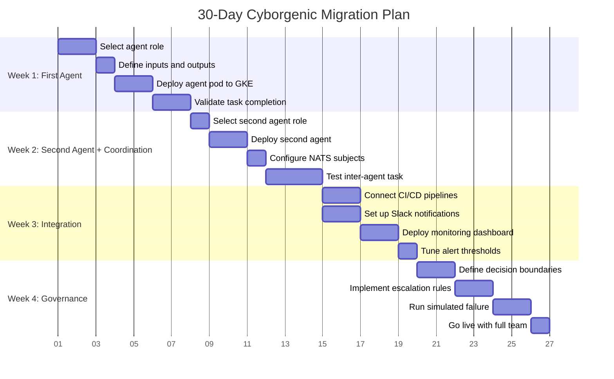
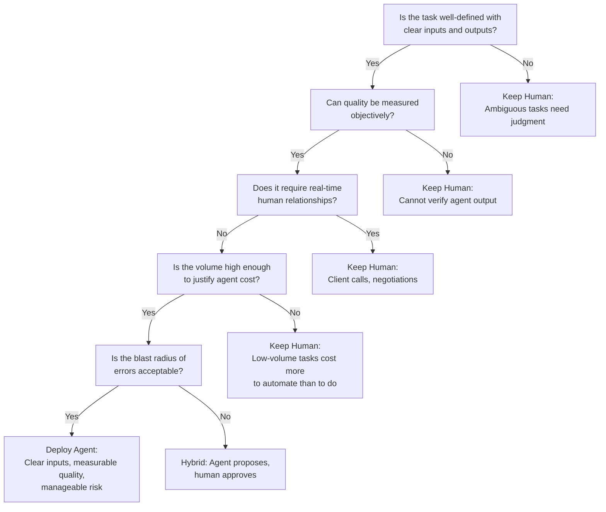

# Tutorial: Migrating Your First Team from Traditional to Cyborgenic in 30 Days

GenBrain AI went from zero agents to a 7-agent [Cyborgenic Organization](/blog/cyborgenic-organizations) in under three months. The first inter-agent task happened on day 19. By the end of month two, agents were coordinating across repos, running security scans, and publishing content with less than 3% human override rate after calibration.

That timeline was not planned. It was discovered through iteration, mistakes, and a lot of NATS message debugging. This tutorial distills those three months of learning into a structured 30-day migration plan. It is designed for teams that already have working software, existing CI/CD, and real workflows they want to augment, not replace, with autonomous agents.

The Cyborgenic model is not "automate everything." It is "put agents where they create the most leverage and build the coordination layer so they can work alongside humans." This tutorial shows you how to get there in four weeks.

## The 30-Day Timeline



## Week 1: Deploy Your First Agent

The most important decision in week one is which agent role to deploy first. Not the most exciting role. The one with the clearest inputs, clearest outputs, and the easiest quality measurement.

At GenBrain, the first production agent was DevOps. It reads infrastructure alerts (clear input), executes runbooks (clear process), and either resolves the alert or escalates (clear output). Success is binary: was the alert resolved without human intervention? That clarity makes it possible to evaluate the agent in days, not weeks.

The second-best starting role is a Security Officer (CSO). It scans repos for vulnerabilities (clear input), produces findings with severity ratings (clear output), and has well-defined quality benchmarks (CVE databases, OWASP guidelines).

### The Decision Tree: Agent or Human?

Not every role should become an agent. Use this decision tree before committing to any migration.



### Deploying the First Agent

The agent role definition is a YAML file that specifies what the agent does, what tools it has access to, and what its operational boundaries are.

```yaml
# agent-role-devops.yaml — first agent deployment
apiVersion: agent.ceo/v1
kind: AgentRole
metadata:
  name: devops-agent
  namespace: agents
  labels:
    team: infrastructure
    migration-week: "1"
spec:
  role: devops
  description: "Monitors infrastructure health, executes runbooks, escalates unresolvable issues"
  model: claude-opus-4-6
  
  inputs:
    - source: "monitoring.alerts.>"
      type: nats-jetstream
      description: "Infrastructure alerts from Prometheus"
    - source: "tasks.devops.>"
      type: nats-jetstream
      description: "Direct task assignments"
  
  outputs:
    - destination: "events.devops.>"
      type: nats-jetstream
      description: "Status updates and resolution reports"
    - destination: "alerts.escalation"
      type: nats-jetstream
      description: "Alerts requiring human intervention"
  
  boundaries:
    max_concurrent_tasks: 3
    token_budget_hourly: 55000
    compaction_threshold: 80000
    allowed_repos:
      - "infrastructure"
      - "deploy"
    forbidden_actions:
      - "delete_production_resources"
      - "modify_iam_policies"
      - "push_to_main_without_review"
  
  escalation:
    conditions:
      - "severity: critical AND confidence < 0.8"
      - "cost_impact > $100"
      - "requires_credentials_not_in_vault"
    target: "founder"
    channel: "slack"
```

Deploy the pod, point it at a non-production workload first, and spend days 5-7 validating task completion. Track every outcome: task description, agent action, correct/incorrect, time to complete. You need this baseline for week 4 governance decisions.

## Week 2: Add a Second Agent and Establish Coordination

The second agent should interact with the first. That interaction is the entire point of week two. An isolated agent is just an automation script with a large language model. Two coordinating agents are the seed of a Cyborgenic Organization.

At GenBrain, the CSO agent was deployed second. It subscribed to events from the DevOps agent's infrastructure changes and automatically scanned any modified configuration for security issues. The first inter-agent task, a CSO security review triggered by a DevOps infrastructure change, completed on day 19.

### NATS Subject Configuration for a New Team

```yaml
# nats-subjects-team-config.yaml — two-agent team
apiVersion: v1
kind: ConfigMap
metadata:
  name: team-subjects
  namespace: agents
data:
  streams.json: |
    {
      "streams": [
        {
          "name": "AGENT_TASKS",
          "subjects": [
            "tasks.devops.>",
            "tasks.cso.>"
          ],
          "retention": "workqueue",
          "max_age_hours": 168,
          "storage": "file",
          "replicas": 3
        },
        {
          "name": "AGENT_EVENTS",
          "subjects": [
            "events.devops.>",
            "events.cso.>",
            "agents.*.throttle",
            "agents.fleet.backpressure"
          ],
          "retention": "limits",
          "max_age_hours": 720,
          "storage": "file",
          "replicas": 3
        }
      ],
      "cross_agent_subscriptions": {
        "cso": {
          "subscribes_to": [
            "events.devops.infrastructure_change",
            "events.devops.config_modified"
          ],
          "triggers": "security_scan"
        },
        "devops": {
          "subscribes_to": [
            "events.cso.vulnerability_found",
            "agents.*.throttle"
          ],
          "triggers": "remediation_or_throttle"
        }
      }
    }
```

The critical design decision here is the separation between AGENT_TASKS (workqueue retention, exactly-once delivery) and AGENT_EVENTS (limits retention, broadcast to all subscribers). Tasks are consumed by one agent. Events are observed by any agent that cares. This distinction prevents duplicate work while enabling cross-agent awareness.

## Week 3: Integrate with Existing Workflows

By week three, you have two agents that coordinate through NATS. Now connect them to the tools your team already uses: CI/CD pipelines, Slack channels, monitoring dashboards.

The integration layer should be thin. Agents trigger your existing CI/CD and respond to its outputs. The DevOps agent creates pull requests; your pipeline runs tests; the agent monitors for post-merge regressions.

Connect Slack so humans see agent activity without checking dashboards. Deploy a Grafana dashboard for task throughput, error rates, and token consumption. Set alert thresholds conservatively; tune them in week four with real data.

## Week 4: Formalize Governance

Governance answers three questions: What do agents decide on their own? What do agents propose for human approval? What stays human-only?

```yaml
# governance-decision-boundaries.yaml
apiVersion: agent.ceo/v1
kind: GovernancePolicy
metadata:
  name: team-governance
  namespace: agents
spec:
  agent_autonomous:
    description: "Agent decides and acts without human approval"
    conditions:
      - "Routine tasks matching established runbooks"
      - "Changes to non-production environments"
      - "Content drafts for internal review queues"
      - "Security scans and vulnerability reports"
      - "Cost impact below $50 per action"
      - "Confidence score above 0.85"
  
  agent_proposes_human_approves:
    description: "Agent prepares action, human reviews and approves"
    conditions:
      - "Production deployments"
      - "Changes affecting customer-facing systems"
      - "Content published externally"
      - "Cost impact between $50 and $500"
      - "New vendor or service integrations"
      - "Confidence score between 0.6 and 0.85"
  
  human_only:
    description: "Agent cannot initiate or execute"
    conditions:
      - "Hiring, firing, or compensation decisions"
      - "Legal agreements or contracts"
      - "Customer escalations requiring empathy"
      - "Strategic direction changes"
      - "Cost impact above $500"
      - "IAM policy modifications"
      - "Data deletion in production"
  
  escalation_protocol:
    primary: "founder"
    channel: "slack"
    timeout_minutes: 60
    fallback: "pause_and_log"
```

GenBrain's experience: after calibration, the human override rate settled below 3%. Most overrides occurred because governance boundaries were too conservative and the human widened them. Boundaries should start tight and relax with evidence, never the reverse.

## What Success Looks Like at Day 30

By the end of this tutorial, you should have:

- Two agents running in production with defined roles and boundaries
- NATS JetStream coordination enabling inter-agent task handoff
- Integration with your existing CI/CD pipeline and notification systems
- A governance framework with documented decision boundaries
- Baseline metrics on task completion rate, accuracy, and cost

GenBrain's fleet now runs 7 agents processing 24,500+ tasks total at $1,150/month with 97.4% uptime. That scale took three months. But the foundation, the first two coordinating agents with proper governance, was laid in the first 30 days. Everything after that is iteration.

For the full story of how this migration unfolded at GenBrain, read the [origin story](/blog/origin-story-one-founder-ai-agents). For enterprise deployment patterns, see the [enterprise adoption playbook](/blog/enterprise-cyborgenic-adoption-playbook). And for the organizational model that makes all of this work, start with [what a Cyborgenic Organization actually is](/blog/cyborgenic-organizations).

## Try agent.ceo

**SaaS** — Get started with 1 free agent-week at [agent.ceo](https://agent.ceo).

**Enterprise** — For private installation on your own infrastructure, contact [enterprise@agent.ceo](mailto:enterprise@agent.ceo).

---
*agent.ceo is built by [GenBrain AI](https://genbrain.ai) — a GenAI-first autonomous agent orchestration platform. General inquiries: hello@agent.ceo | Security: security@agent.ceo*
