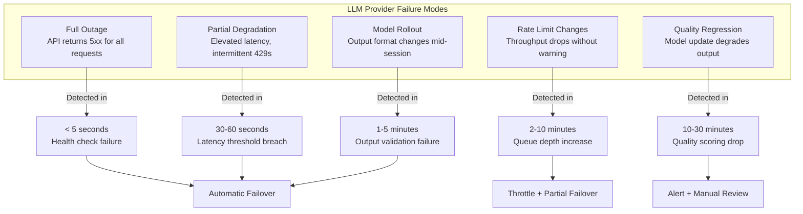
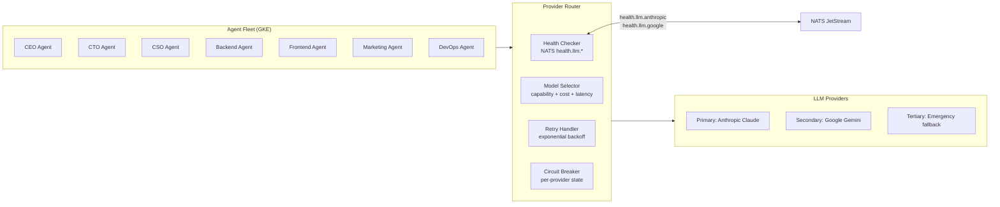
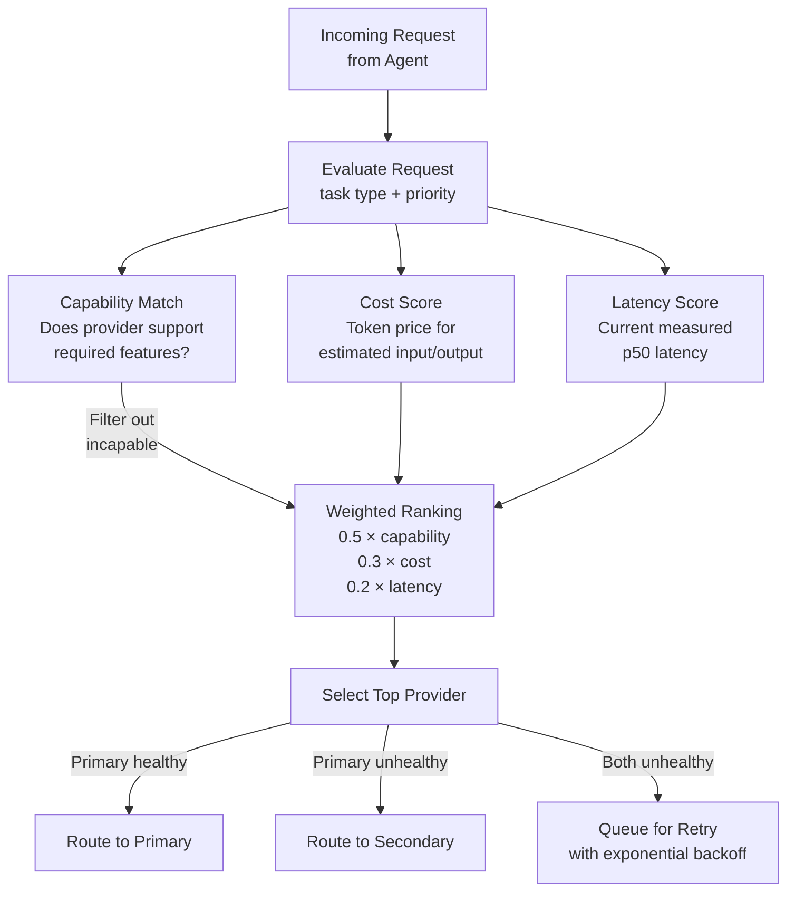
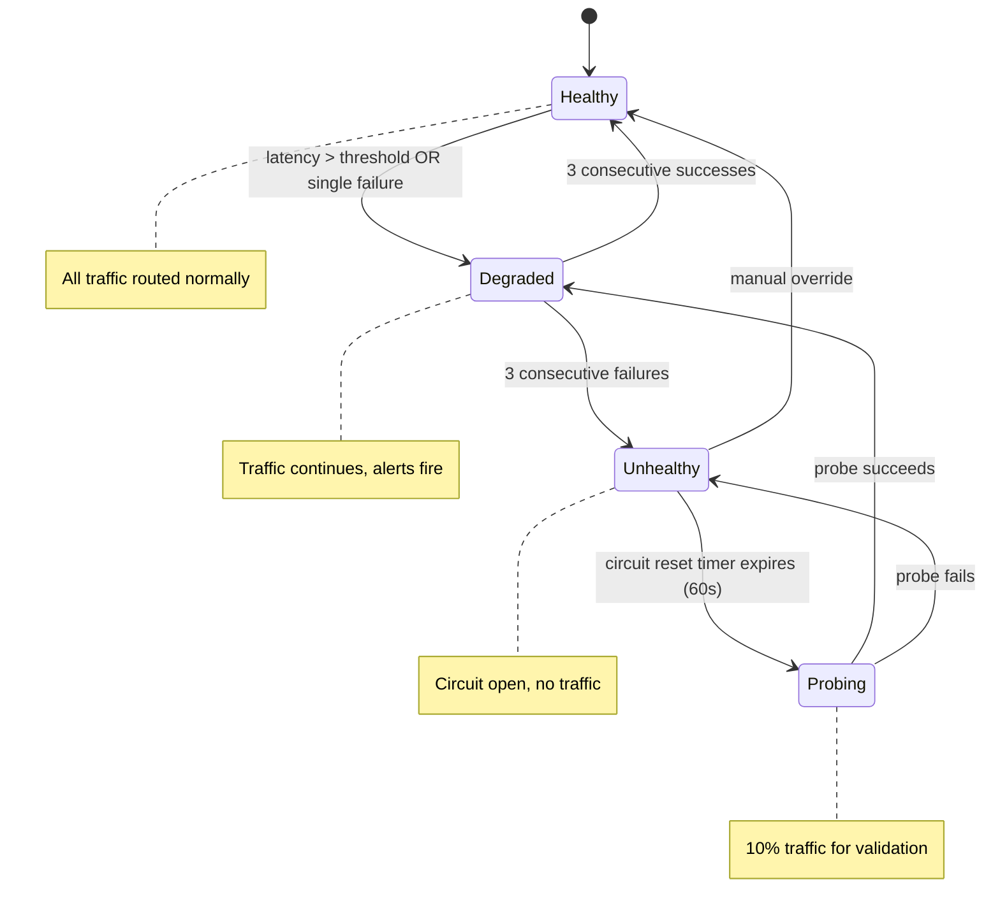

# Multi-LLM Failover Strategy: Never Let a Provider Outage Stop Your Agents

On September 3, 2026, our primary LLM provider went down for 38 minutes during a model rollout. Our 7 agents at [agent.ceo](https://agent.ceo) kept working. The CTO Agent switched to a secondary provider in 4.2 seconds. The Marketing Agent was mid-draft on a LinkedIn post and finished it without a hiccup. The CSO Agent completed a security scan using its fallback model. Zero tasks were lost. Zero SLA violations occurred. The incident showed up in our logs but not in our output.

Six months earlier, the story was different. A similar outage took down our entire fleet for 47 minutes. In a Cyborgenic Organization -- where 7 AI agents fill real roles (CEO, CTO, CSO, Backend, Frontend, Marketing, DevOps) and operate 24/7 -- 47 minutes of downtime is not a blip. It is hundreds of tasks stalled, content deadlines missed, and security scans deferred. That outage is why we built automatic failover. This post walks through exactly how we did it.

## The Problem: Single Points of Failure in Agent Fleets

Most teams building AI agent systems treat the LLM provider like a utility. You call the API, you get a response. If the API is down, you wait. This works when agents are experimental tools. It breaks when agents are your workforce.

GenBrain AI runs [agent.ceo](https://agent.ceo) as a production Cyborgenic Organization: 7 AI agents, one human founder (Moshe Beeri, Beeri B.V., Netherlands), operational since February 2026, 24,500+ tasks completed, $1,150/month total cost. At that scale, every minute of downtime has a measurable cost in lost output. Our agents have published 155 blog posts, 365 LinkedIn posts, and handled thousands of code reviews, security scans, and infrastructure operations. Provider reliability is not a nice-to-have. It is a production requirement.

The failure modes we have observed across 9+ months of continuous operation fall into five categories:



Full outages are the easiest to handle. Partial degradation is harder. Quality regressions are the hardest and often require human judgment. Our failover system handles the first three automatically and escalates the last two to the founder.

## Architecture: The Provider Health Layer

The core of our failover system is a health layer that sits between every agent and every LLM provider. No agent calls an LLM API directly. Instead, every request goes through a provider router that checks health status, selects the best available model, and handles retries transparently.



Every component in the router is stateless. Provider health state lives in NATS JetStream, which means any agent in any pod can read the current health status without querying the router directly. This is critical in a Kubernetes environment where pods restart, scale, and migrate.

## Health Checks: The NATS Pattern

We run continuous health checks against every configured provider. Each check sends a minimal completion request (a short prompt requesting a single-word response) and measures three things: whether the request succeeded, how long it took, and whether the response was well-formed.

```typescript
// provider-health-checker.ts — runs as a sidecar in each agent pod
import { connect, StringCodec, JetStreamClient } from "nats";

interface HealthStatus {
  provider: string;
  healthy: boolean;
  latencyMs: number;
  lastChecked: string;
  consecutiveFailures: number;
  circuitState: "closed" | "half-open" | "open";
}

const HEALTH_CHECK_INTERVAL_MS = 15_000;
const LATENCY_THRESHOLD_MS = 8_000;
const FAILURE_THRESHOLD = 3;
const CIRCUIT_RESET_MS = 60_000;

async function checkProviderHealth(
  provider: string,
  endpoint: string,
  apiKey: string
): Promise<HealthStatus> {
  const start = Date.now();
  try {
    const response = await fetch(endpoint, {
      method: "POST",
      headers: {
        "Content-Type": "application/json",
        Authorization: `Bearer ${apiKey}`,
      },
      body: JSON.stringify({
        model: getHealthCheckModel(provider),
        max_tokens: 10,
        messages: [{ role: "user", content: "Reply with OK." }],
      }),
      signal: AbortSignal.timeout(LATENCY_THRESHOLD_MS),
    });

    const latencyMs = Date.now() - start;
    const healthy = response.ok && latencyMs < LATENCY_THRESHOLD_MS;

    return {
      provider,
      healthy,
      latencyMs,
      lastChecked: new Date().toISOString(),
      consecutiveFailures: healthy ? 0 : 1,
      circuitState: healthy ? "closed" : "half-open",
    };
  } catch (error) {
    return {
      provider,
      healthy: false,
      latencyMs: Date.now() - start,
      lastChecked: new Date().toISOString(),
      consecutiveFailures: 1,
      circuitState: "half-open",
    };
  }
}

async function publishHealth(js: JetStreamClient, status: HealthStatus) {
  const sc = StringCodec();
  await js.publish(
    `health.llm.${status.provider}`,
    sc.encode(JSON.stringify(status))
  );
}

// Main loop: check every provider every 15 seconds
async function runHealthLoop() {
  const nc = await connect({ servers: "nats://nats.agents.svc:4222" });
  const js = nc.jetstream();

  const providers = [
    { name: "anthropic", endpoint: "https://api.anthropic.com/v1/messages", key: process.env.ANTHROPIC_API_KEY! },
    { name: "google", endpoint: "https://generativelanguage.googleapis.com/v1beta/models", key: process.env.GOOGLE_API_KEY! },
  ];

  setInterval(async () => {
    for (const p of providers) {
      const status = await checkProviderHealth(p.name, p.endpoint, p.key);
      await publishHealth(js, status);
    }
  }, HEALTH_CHECK_INTERVAL_MS);
}
```

The health check runs every 15 seconds. If a provider fails three consecutive checks (45 seconds of sustained failure), the circuit breaker opens and the model selector stops routing to that provider entirely. When the circuit is open, a lightweight probe continues checking every 60 seconds. The first successful probe moves the circuit to half-open, which routes 10% of traffic to the recovering provider. Three consecutive successes close the circuit fully.

This pattern -- borrowed from service mesh circuit breakers but adapted for LLM APIs -- gives us fast detection (under 45 seconds for full outages) without false positives from transient network glitches.

## Model Selection: Cost vs. Latency vs. Quality

When multiple providers are healthy, the model selector must decide which one handles each request. This is not a simple round-robin. Different tasks have different requirements, and different providers have different strengths.

We score each provider on three dimensions for every request:



The weighting changes by task type. For code generation tasks (Backend and Frontend agents), capability weight increases to 0.7 because code quality directly impacts production. For content tasks (Marketing agent), the weight distribution is more balanced because multiple providers produce acceptable content quality. For security analysis (CSO agent), we lock to the primary provider unless it is fully down, because we validated our security prompts against a specific model's behavior.

Here is the practical cost and quality comparison we measured across 30 days of production traffic:

| Dimension | Primary (Claude) | Secondary (Gemini) | Delta |
|-----------|-----------------|-------------------|-------|
| Code generation accuracy | 94.2% | 87.1% | -7.1% |
| Content quality score | 8.7/10 | 8.1/10 | -0.6 |
| Security analysis depth | 9.1/10 | 7.8/10 | -1.3 |
| Median latency (p50) | 2.1s | 1.8s | -0.3s |
| Cost per 1K output tokens | $0.015 | $0.010 | -33% |
| Tool use reliability | 98.7% | 93.4% | -5.3% |

The secondary provider is 33% cheaper per token but produces measurably lower quality on code and security tasks. The math is clear: use the primary when healthy, fail over when it is not, and accept the temporary quality dip. A slightly worse blog draft is better than no blog draft.

## The Failover State Machine

Each provider connection follows a state machine that governs traffic routing decisions.



In practice, most incidents follow the Healthy to Degraded to Unhealthy path and recover through Probing back to Degraded and then Healthy. The entire cycle from first failure to full recovery typically completes in 3-5 minutes. During that window, agents continue operating on the secondary provider without interruption.

## Results: 97.4% Uptime and Counting

Since deploying automatic failover in June 2026, our fleet-wide uptime has held at 97.4%. More importantly, the nature of our downtime changed. Before failover, downtime meant all agents stopped. After failover, our remaining downtime comes from GKE node rotations, NATS cluster maintenance, and agent-specific bugs -- not LLM provider issues.

The failover system has triggered 14 times in five months:
- 8 times for transient API errors (resolved in under 30 seconds, agents never noticed)
- 4 times for provider degradation (5-15 minutes on secondary provider)
- 2 times for extended outages (30+ minutes on secondary provider)

In all 14 cases, zero tasks were lost and zero SLA violations occurred.

The cost impact of failover is minimal. Secondary provider usage accounts for roughly 3% of our total token spend. At our $1,150/month operating cost, that is approximately $21/month in "insurance" for near-continuous availability. Compared to the cost of an hour of fleet downtime -- estimated at $180 in delayed output and missed deadlines -- this is a straightforward investment.

## Lessons Learned

**Test failover before you need it.** We run monthly failover drills where we manually open the circuit breaker on the primary provider and verify that all 7 agents continue operating on the secondary. The first drill revealed that our [content pipeline](/blog/automated-content-pipeline-cyborgenic) had hardcoded prompt templates that did not work with the secondary model's output format. We would not have found this during an actual outage.

**Monitor the secondary provider continuously, not just during failover.** If your secondary provider degrades and you do not notice until your primary also fails, you have no failover at all. Our health checks run against all providers all the time, regardless of which one is active.

**Accept quality degradation during failover.** Trying to maintain identical output quality across providers is a fool's errand. Different models have different strengths. The goal during failover is continuity, not perfection. Our agents produce slightly lower-quality output on the secondary provider, and that is acceptable because the alternative is producing nothing.

**Keep the failover path simple.** Every additional provider in your failover chain adds complexity, configuration, and cost. Two providers (primary plus one fallback) handle 99% of scenarios. A third emergency fallback is useful only if both primary providers share a common failure mode, which is rare.

Building resilience into a Cyborgenic Organization is not optional -- it is what separates a demo from a production system. Our 7 agents have completed 24,500+ tasks across 9 months because they keep running when things break. The failover system is invisible when it works, which is exactly what good infrastructure should be. If your agents stop working every time your LLM provider hiccups, you do not have an autonomous organization. You have a fragile script with a dependency.
