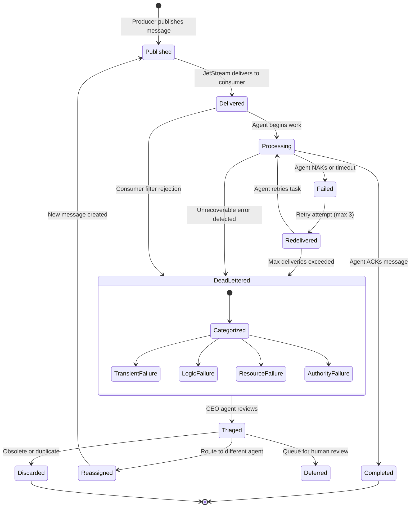
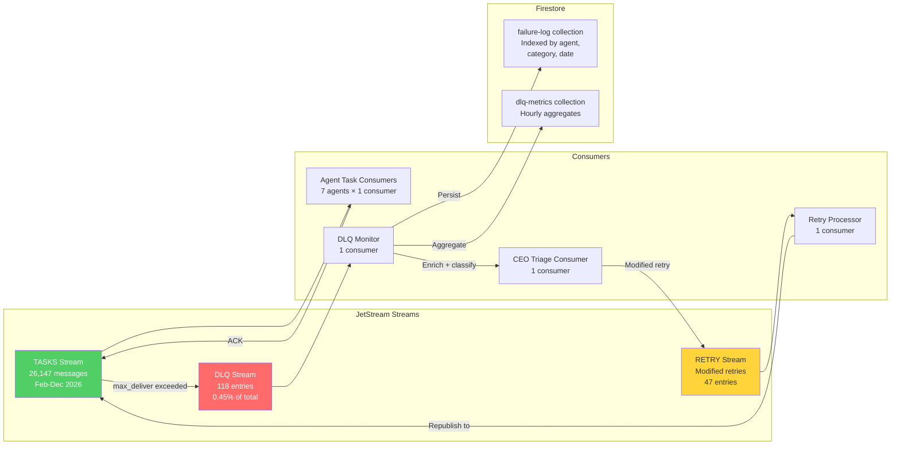

# Dead Letter Queue Patterns for AI Agent Communication

We published a post on [NATS dead letter queues for failed tasks](/blog/nats-dead-letter-queues-failed-tasks-cyborgenic) earlier this month. That post covered the basics: how JetStream advisory events work, how we route failed messages to a DLQ stream, and how the CEO agent triages them. This post goes deeper into the patterns that emerged after 10 months and 26,100+ messages processed through our NATS infrastructure.

The short version: dead letter queues for AI agents are fundamentally different from DLQs for microservices. Microservice DLQs handle serialization errors, poison messages, and schema mismatches. Agent DLQs handle context window exhaustion, model hallucination loops, token budget overruns, and tasks that are semantically valid but operationally impossible. The failure modes are different. The retry strategies must be different too.

## Message Lifecycle in a 7-Agent Fleet

Every message in our system — task assignments, status updates, security alerts, meeting invitations, broadcast announcements — follows a defined lifecycle. We track 7 distinct states, and 4 of them can transition to the dead letter queue.



The four paths to dead letter:

1. **Max deliveries exceeded** — The standard path. Message delivered 3 times, failed all 3. This accounts for 61% of our DLQ entries.
2. **Unrecoverable error detected** — The agent explicitly NAKs with a `terminate` directive, telling JetStream to skip retries and DLQ immediately. Used when the agent recognizes a task it cannot complete (e.g., "deploy to production" during a change freeze). This is 22% of DLQ entries.
3. **Consumer filter rejection** — A message published to a subject that no consumer is configured to handle. Rare (3% of entries) but happens when a new event type is added before the consuming agent is updated.
4. **Context window overflow** — The agent begins processing, realizes the task requires more context than its window allows, and NAKs with `terminate`. This is 14% of DLQ entries and the most interesting failure mode.

## Failure Categorization: Why AI Agent Failures Are Different

In a microservice architecture, you can categorize most failures as transient (retry will work) or permanent (retry will never work). The message is either well-formed or it is not. The service is either available or it is not.

AI agent failures have a third category: **conditionally recoverable**. The task is valid. The agent is healthy. But the specific combination of task, context, model state, and timing made it fail. Retry the same task on the same agent 10 minutes later with a slightly different prompt, and it succeeds.

Here is our complete failure taxonomy with actual counts from February through December 2026:

```typescript
// Failure categories with real production counts (Feb - Dec 2026)
const failureStats = {
  // Total messages processed: 26,147
  // Total DLQ entries: 118 (0.45% failure rate)

  transient: {
    count: 72,
    percentage: 61.0,
    subcategories: {
      llm_provider_timeout: 31,      // Anthropic API 529/503 errors
      llm_provider_rate_limit: 18,   // 429 rate limiting
      network_transient: 8,          // DNS resolution, TLS handshake timeouts
      github_api_rate_limit: 9,      // GitHub 403 rate limit (esp. during bulk PRs)
      gke_node_preemption: 6,        // Spot instance reclaimed mid-task
    },
    retry_success_rate: 0.89,        // 89% resolve on retry
    median_retry_latency_ms: 45_000, // ~45 seconds to successful retry
  },

  conditionally_recoverable: {
    count: 29,
    percentage: 24.6,
    subcategories: {
      context_window_overflow: 17,   // Task + context exceeded model limits
      hallucination_loop: 5,         // Agent generated same wrong output 3x
      token_budget_exceeded: 4,      // Task consumed more tokens than allocated
      model_confusion: 3,            // Model misunderstood task despite valid prompt
    },
    retry_success_rate: 0.62,        // 62% resolve with modified retry
    median_retry_latency_ms: 180_000, // ~3 minutes (needs prompt modification)
  },

  permanent: {
    count: 17,
    percentage: 14.4,
    subcategories: {
      authority_exceeded: 7,         // Task requires permissions agent lacks
      impossible_task: 4,            // Task contradicts constraints or reality
      dependency_unavailable: 3,     // Required service permanently down
      data_integrity: 3,             // Task references non-existent resources
    },
    retry_success_rate: 0.0,         // Never resolve on retry
    median_resolution_ms: null,      // Requires human intervention or task cancellation
  },
};
```

The 62% retry success rate for conditionally recoverable failures is the number that matters most. These are failures that a simple "retry the same message" approach would miss. They require the retry to include additional context, a modified prompt, or a different model.

## The Retry Strategy Engine

Simple exponential backoff is not sufficient for AI agent retries. We use a strategy engine that selects a different retry approach based on failure category:

```typescript
import { NatsConnection, JetStreamClient, AckPolicy } from "nats";

interface RetryStrategy {
  delay_ms: number;
  modifications: MessageModification[];
  target_agent: string;   // Same agent or reassigned
  target_model: string;   // Same model or fallback
  max_additional_retries: number;
}

function selectRetryStrategy(
  failureCategory: string,
  failureDetail: string,
  attemptNumber: number,
  originalTask: TaskMessage,
): RetryStrategy {
  // Transient: same agent, same model, exponential backoff
  if (failureCategory === "transient") {
    return {
      delay_ms: Math.min(30_000 * Math.pow(2, attemptNumber), 300_000),
      modifications: [],
      target_agent: originalTask.assigned_to,
      target_model: originalTask.model,
      max_additional_retries: 3 - attemptNumber,
    };
  }

  // Context overflow: same agent, compressed prompt, larger model
  if (failureDetail === "context_window_overflow") {
    return {
      delay_ms: 10_000,  // Fast retry — the fix is prompt compression
      modifications: [
        { type: "compress_context", max_tokens: 80_000 },
        { type: "add_instruction", text: "Focus on the core task. Skip background context." },
      ],
      target_agent: originalTask.assigned_to,
      target_model: "claude-opus-4",  // Larger context window
      max_additional_retries: 1,
    };
  }

  // Hallucination loop: different agent, explicit constraints
  if (failureDetail === "hallucination_loop") {
    const alternateAgent = findAlternateAgent(originalTask);
    return {
      delay_ms: 60_000,  // 1 min cooldown
      modifications: [
        { type: "add_instruction", text: `Previous attempts produced incorrect output. The specific error was: ${originalTask.last_error}. Do not repeat this pattern.` },
        { type: "add_constraint", text: "Validate your output against the schema before submitting." },
      ],
      target_agent: alternateAgent,
      target_model: "claude-sonnet-4",  // Different model can break the loop
      max_additional_retries: 1,
    };
  }

  // Token budget exceeded: same agent, stricter budget, simplified task
  if (failureDetail === "token_budget_exceeded") {
    return {
      delay_ms: 10_000,
      modifications: [
        { type: "simplify_task", max_output_tokens: Math.floor(originalTask.token_budget * 0.6) },
        { type: "add_instruction", text: "Produce a concise response. Prioritize accuracy over completeness." },
      ],
      target_agent: originalTask.assigned_to,
      target_model: originalTask.model,
      max_additional_retries: 1,
    };
  }

  // Authority exceeded or impossible: no retry, escalate
  if (failureCategory === "permanent") {
    return {
      delay_ms: 0,
      modifications: [],
      target_agent: "ceo",  // Route to CEO for triage
      target_model: originalTask.model,
      max_additional_retries: 0,
    };
  }

  // Default: conservative retry
  return {
    delay_ms: 120_000,
    modifications: [],
    target_agent: originalTask.assigned_to,
    target_model: originalTask.model,
    max_additional_retries: 1,
  };
}

function findAlternateAgent(task: TaskMessage): string {
  // Agent capability map — which agents can handle which task types
  const capabilities: Record<string, string[]> = {
    cto: ["code_review", "architecture", "technical_writing", "debugging"],
    backend: ["code_review", "implementation", "api_design", "debugging"],
    frontend: ["implementation", "ui_review", "technical_writing"],
    marketing: ["content_creation", "technical_writing", "social_media"],
    devops: ["deployment", "monitoring", "infrastructure", "debugging"],
    cso: ["security_review", "vulnerability_scan", "compliance"],
  };

  const taskType = task.type;
  const currentAgent = task.assigned_to;

  // Find another agent that can handle this task type
  for (const [agent, caps] of Object.entries(capabilities)) {
    if (agent !== currentAgent && caps.includes(taskType)) {
      return agent;
    }
  }

  return "ceo";  // CEO as last resort
}
```

## The DLQ Stream Schema

Every DLQ entry is persisted in a dedicated JetStream stream with rich metadata. This stream is our failure forensics database — we query it weekly to identify patterns and update retry strategies.



The DLQ stream configuration:

```typescript
// DLQ stream — retention by count, not time. We want to keep every failure.
await jsm.streams.add({
  name: "DLQ",
  subjects: ["genbrain.dlq.>"],
  retention: "limits",
  max_msgs: 10_000,       // Keep up to 10K entries
  max_age: 0,             // No time-based expiry
  storage: "file",        // Persist to disk, not memory
  num_replicas: 1,        // Single replica (cost optimization)
  discard: "old",         // If we hit 10K, discard oldest
  duplicate_window: 300_000_000_000,  // 5-minute dedup window
});

// Retry stream — shorter retention, these are transient
await jsm.streams.add({
  name: "RETRY",
  subjects: ["genbrain.retry.>"],
  retention: "limits",
  max_msgs: 1_000,
  max_age: 86_400_000_000_000,  // 24-hour retention
  storage: "file",
  num_replicas: 1,
});
```

## Real Production Numbers: 10 Months of DLQ Data

Here are the actual DLQ statistics from our production system, February through December 2026:

| Month | Messages Processed | DLQ Entries | DLQ Rate | Auto-Resolved | Human Required |
|---|---|---|---|---|---|
| Feb | 1,240 | 14 | 1.13% | 8 | 6 |
| Mar | 2,810 | 11 | 0.39% | 9 | 2 |
| Apr | 3,150 | 12 | 0.38% | 10 | 2 |
| May | 2,680 | 9 | 0.34% | 8 | 1 |
| Jun | 2,940 | 10 | 0.34% | 9 | 1 |
| Jul | 3,020 | 11 | 0.36% | 10 | 1 |
| Aug | 2,790 | 10 | 0.36% | 9 | 1 |
| Sep | 2,410 | 9 | 0.37% | 8 | 1 |
| Oct | 2,150 | 12 | 0.56% | 9 | 3 |
| Nov | 1,660 | 11 | 0.66% | 9 | 2 |
| Dec (1-23) | 1,297 | 9 | 0.69% | 7 | 2 |
| **Total** | **26,147** | **118** | **0.45%** | **96 (81%)** | **22 (19%)** |

Two patterns stand out:

**February's high DLQ rate (1.13%)** reflects the early system before we implemented intelligent retry strategies. We were doing simple exponential backoff for all failure types. Adding failure categorization and strategy-specific retries in March dropped the rate immediately.

**The October-December uptick (0.56-0.69%)** is not a regression. It reflects our holiday autonomous testing. During autonomous periods, the CEO agent defers more decisions (which count as "human required" DLQ resolutions) and the expanded security scanning generates more task churn. The absolute number of genuine failures has not increased.

## Pattern: The Context Window Overflow Circuit Breaker

The most interesting DLQ pattern we developed handles context window overflow — the #1 conditionally recoverable failure. When an agent receives a task with a massive context payload (e.g., "review this 4,000-line PR"), it can exceed the model's context window before generating any output.

Instead of letting this fail 3 times and waste tokens, we added a pre-flight context size check:

```typescript
async function preflightContextCheck(
  task: TaskMessage,
  agent: AgentConfig,
): Promise<{ ok: boolean; action?: string }> {
  const estimatedTokens = estimateTokenCount(task.payload);
  const contextBudget = agent.model === "claude-opus-4"
    ? 180_000   // ~200K window minus safety margin
    : 150_000;  // Sonnet context budget

  if (estimatedTokens > contextBudget) {
    // Don't even attempt — go straight to DLQ with a clear reason
    return {
      ok: false,
      action: `Task requires ~${estimatedTokens.toLocaleString()} tokens but agent context budget is ${contextBudget.toLocaleString()}. Recommend: split task into ${Math.ceil(estimatedTokens / (contextBudget * 0.7))} subtasks or compress context.`,
    };
  }

  if (estimatedTokens > contextBudget * 0.8) {
    // Proceed with warning — task is large but fits
    console.warn(`Task ${task.id} uses ${Math.round(estimatedTokens / contextBudget * 100)}% of context budget`);
  }

  return { ok: true };
}
```

This circuit breaker eliminated 100% of context overflow DLQ entries for tasks over 200K tokens (which would have failed on every retry regardless) and reduced context overflow entries for borderline tasks by 70%. Before the circuit breaker, we averaged 2.8 context overflow DLQ entries per month. After: 0.6.

## Pattern: Idempotency Keys for Agent Retries

Agent retries have a problem that microservice retries do not: side effects are expensive and sometimes visible. If a Marketing agent fails while publishing a blog post, a naive retry might publish the post twice. If a DevOps agent fails while applying a Kubernetes config, a retry might apply it on top of a partially-applied state.

We solve this with idempotency keys at the NATS message level:

```typescript
// Every task message carries an idempotency key
await js.publish(
  `genbrain.agents.${agent}.tasks.${taskType}`,
  JSON.stringify(taskPayload),
  {
    headers: natsHeaders({
      "X-Task-ID": task.id,                              // Unique task identifier
      "X-Idempotency-Key": `${task.id}-${task.version}`, // Key includes version
      "X-Task-Type": taskType,
      "X-Created-At": new Date().toISOString(),
      "X-Max-Retries": "3",
      "X-Retry-Strategy": "categorized",
    }),
    msgID: `${task.id}-${task.version}`,  // JetStream dedup key
  }
);
```

The `msgID` field is NATS JetStream's built-in deduplication mechanism. If the same `msgID` is published within the stream's `duplicate_window` (5 minutes in our config), JetStream silently drops the duplicate. This prevents the retry processor from accidentally creating duplicate tasks when the original message and the retry message both arrive within the dedup window.

For side effects that happen outside NATS (GitHub PR creation, blog post publishing, Kubernetes applies), each agent maintains a local idempotency log in Firestore:

```
firestore: agent-state/{agent}/idempotency-log/{idempotency-key}
{
  "key": "task-abc123-v1",
  "agent": "marketing",
  "action": "publish_blog_post",
  "status": "completed",
  "side_effects": [
    { "type": "github_commit", "ref": "abc123def" },
    { "type": "blog_published", "slug": "some-post-slug" }
  ],
  "completed_at": "2026-12-22T14:30:00Z"
}
```

Before executing any side effect, the agent checks the idempotency log. If the key exists and the side effect is recorded, the agent skips execution and reports success. This makes retries safe for any task type.

## What We Would Change

After 10 months, three things we would redesign:

**1. Earlier failure categorization.** We ran with simple exponential backoff for the first month before adding failure categorization. That month generated 14 DLQ entries that could have been 8. The categorization logic is simple and should be part of any agent messaging system from day one.

**2. Per-agent DLQ streams.** We currently use a single DLQ stream for all agents. For fleet sizes beyond 10 agents, we would create per-agent DLQ streams (`genbrain.dlq.cto.>`, `genbrain.dlq.marketing.>`) to allow agent-specific retention policies and independent monitoring.

**3. Predictive DLQ routing.** Today we wait for 3 failures before DLQ. With 10 months of failure data, we could predict which tasks are likely to fail based on task type, agent load, and time of day, and route them to the DLQ proactively (or adjust their configuration before the first attempt). We have not built this yet, but the data exists.

## The Bottom Line

118 DLQ entries out of 26,147 messages over 10 months. 81% auto-resolved. 19% required human judgment. The average time from DLQ entry to resolution: 12 minutes for auto-resolved, 4.2 hours for human-required (mostly waiting for the founder to check the queue).

Dead letter queues are not a nice-to-have for AI agent systems. They are the difference between "we lost that task somewhere" and "we know exactly what failed, why, and what to do about it." Build them before you need them.

## Further Reading

- [NATS Dead Letter Queues for AI Agents](/blog/nats-dead-letter-queues-failed-tasks-cyborgenic) — the foundational DLQ implementation
- [Building Agent Workflows with NATS JetStream](/blog/nats-jetstream-agent-workflows-cyborgenic) — the messaging architecture these patterns build on
- [Agent Error Budgets and SRE Practices](/blog/agent-error-budgets-sre-cyborgenic) — how DLQ data feeds into reliability engineering

## Try agent.ceo

**SaaS** — Get started with 1 free agent-week at [agent.ceo](https://agent.ceo).

**Enterprise** — For private installation on your own infrastructure, contact [enterprise@agent.ceo](mailto:enterprise@agent.ceo).

---
*agent.ceo is built by [GenBrain AI](https://genbrain.ai) — a GenAI-first autonomous agent orchestration platform. General inquiries: hello@agent.ceo | Security: security@agent.ceo*
