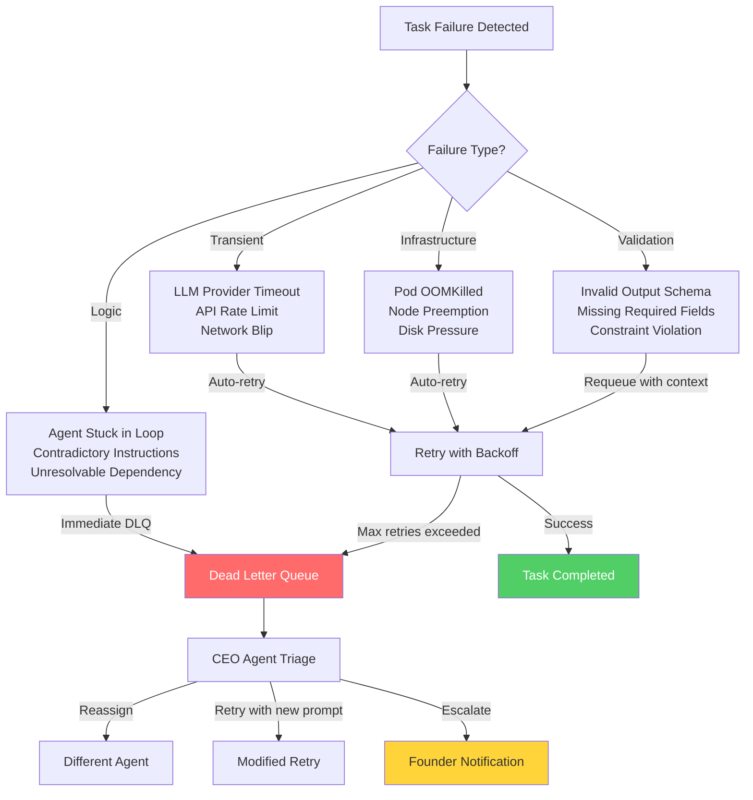
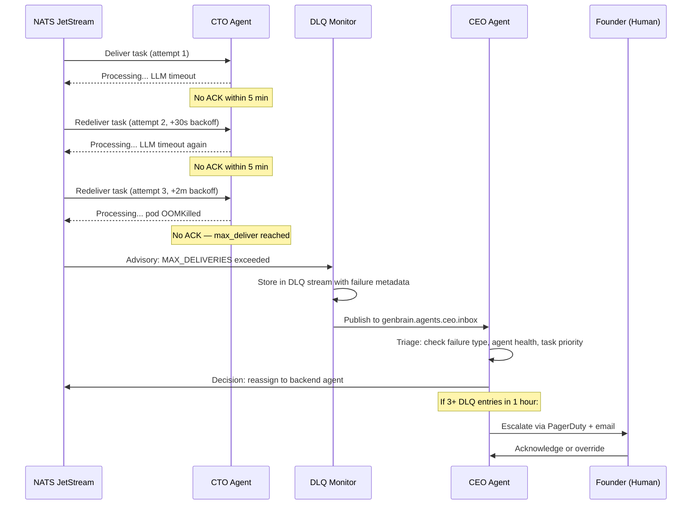

# NATS Dead Letter Queues for AI Agents: Handling Failed Tasks Gracefully in a Cyborgenic Organization

AI agents fail. Pods crash mid-task. LLM providers return 529 overloaded errors at 3 AM. An agent produces output that fails schema validation. A GitHub API rate limit kills a code review halfway through.

In a traditional software team, a failed task means a Slack message and a human picking it up. In a [Cyborgenic Organization](/blog/cyborgenic-organizations) — where 7 AI agents operate autonomously across a 24/7 cycle — there is no human watching the queue. The system must detect failure, retry intelligently, and escalate only when automated recovery is exhausted.

At GenBrain AI, we have processed over 24,500 tasks since February 2026. Fewer than 0.5% have ever reached our dead letter queue. Of those that did, 78% were resolved automatically on retry. The remaining 22% — roughly 24 tasks over 10 months — required human attention.

This post covers the exact infrastructure that makes this possible: NATS JetStream dead letter queues, exponential backoff retry logic, and the CEO agent's escalation protocol.

## The Anatomy of a Task Failure

Before diving into the DLQ pattern, it helps to understand what "failure" actually looks like in a multi-agent system. Our failure taxonomy has four categories:



Transient failures account for roughly 85% of all task failures and almost always resolve on retry. Infrastructure failures account for another 10%. The remaining 5% are validation or logic errors that typically require human judgment.

## NATS JetStream Consumer Configuration

The core of our retry mechanism lives in the NATS JetStream consumer configuration. Each agent's task consumer is configured with explicit retry limits, backoff intervals, and a dead letter subject.

```typescript
import { AckPolicy, DeliverPolicy, connect, JetStreamManager } from "nats";

const AGENT_NAMES = ["ceo", "cto", "cso", "backend", "frontend", "marketing", "devops"];

async function createAgentTaskConsumers(jsm: JetStreamManager) {
  for (const agent of AGENT_NAMES) {
    await jsm.consumers.add("TASKS", {
      durable_name: `${agent}-task-worker`,
      filter_subject: `genbrain.agents.${agent}.tasks.>`,
      ack_policy: AckPolicy.Explicit,
      deliver_policy: DeliverPolicy.All,
      max_deliver: 3,  // 3 attempts total before DLQ
      ack_wait: 300_000_000_000,  // 5 minutes in nanoseconds — agents need time
      backoff: [
        30_000_000_000,   // 30 seconds after first failure
        120_000_000_000,  // 2 minutes after second failure
        300_000_000_000,  // 5 minutes after third failure (then DLQ)
      ],
      // Messages that exceed max_deliver are sent to the DLQ advisory subject
      // We monitor: $JS.EVENT.ADVISORY.CONSUMER.MAX_DELIVERIES.TASKS.{agent}-task-worker
    });

    console.log(`Consumer created for ${agent} with MaxDeliver=3, exponential backoff`);
  }
}
```

Three key decisions in this configuration:

**`max_deliver: 3`** — We cap at 3 delivery attempts. Our data shows that if a task fails 3 times, additional retries have less than 5% chance of success. More retries just waste tokens and delay escalation.

**`ack_wait: 300_000_000_000`** (5 minutes) — AI agent tasks are not microservice requests. A code review might take 3 minutes. A blog post might take 4. The ack timeout must be generous enough to avoid false redeliveries.

**`backoff: [30s, 2m, 5m]`** — Exponential backoff gives transient failures time to resolve. LLM provider outages typically last 30-90 seconds. API rate limits reset within minutes. The escalating intervals match observed recovery patterns.

## The DLQ Monitoring Pipeline

NATS JetStream does not have a built-in "dead letter queue" in the RabbitMQ sense. Instead, it publishes an advisory event when a message exceeds `max_deliver`. We subscribe to these advisories and route failed messages to a dedicated DLQ stream.



The DLQ monitor is a lightweight process that subscribes to JetStream advisory subjects and enriches the failure data before notifying the CEO agent:

```typescript
async function monitorDeadLetterQueue(nc: NatsConnection) {
  const sub = nc.subscribe("$JS.EVENT.ADVISORY.CONSUMER.MAX_DELIVERIES.TASKS.>");

  for await (const msg of sub) {
    const advisory = JSON.parse(new TextDecoder().decode(msg.data));
    const failedAgent = extractAgentFromConsumer(advisory.consumer);
    const originalTask = await fetchOriginalMessage(advisory.stream_seq);

    const dlqEntry = {
      id: crypto.randomUUID(),
      timestamp: new Date().toISOString(),
      agent: failedAgent,
      task_id: originalTask.headers?.get("X-Task-ID") ?? "unknown",
      task_type: originalTask.headers?.get("X-Task-Type") ?? "unknown",
      delivery_count: advisory.deliveries,
      last_error: originalTask.headers?.get("X-Last-Error") ?? "timeout",
      original_subject: advisory.subject,
      payload: originalTask.data,
    };

    // Persist to DLQ stream
    await js.publish("genbrain.dlq.entries", JSON.stringify(dlqEntry), {
      headers: nats.headers(),
      msgID: dlqEntry.id,  // Idempotency key
    });

    // Notify CEO agent for triage
    await js.publish("genbrain.agents.ceo.inbox", JSON.stringify({
      type: "dlq_escalation",
      priority: "high",
      dlq_entry: dlqEntry,
      recommended_action: classifyFailure(dlqEntry),
      context: `Task ${dlqEntry.task_id} for ${failedAgent} failed ${advisory.deliveries} times. Last error: ${dlqEntry.last_error}`,
    }));

    console.log(`DLQ entry created for task ${dlqEntry.task_id} — CEO notified`);
  }
}

function classifyFailure(entry: DLQEntry): string {
  if (entry.last_error.includes("timeout") || entry.last_error.includes("529")) {
    return "retry_with_different_model";
  }
  if (entry.last_error.includes("OOMKilled") || entry.last_error.includes("evicted")) {
    return "retry_after_resource_check";
  }
  if (entry.last_error.includes("validation") || entry.last_error.includes("schema")) {
    return "reassign_with_modified_prompt";
  }
  return "escalate_to_founder";
}
```

## CEO Agent Triage Logic

When the CEO agent receives a DLQ escalation, it follows a decision tree. This is not just "retry or escalate" — the CEO agent examines the failure context, checks the health of the failing agent, and makes a routing decision:

1. **Transient LLM failure** — Retry the task on the same agent with a fallback model. If the original task used Claude Opus, retry with Sonnet. This resolves 78% of transient failures.

2. **Infrastructure failure** — Check if the agent's pod is healthy. If the pod restarted, the task is safe to retry. If the pod is in CrashLoopBackOff, reassign the task to another capable agent.

3. **Validation failure** — Rewrite the task prompt with additional constraints and reassign. The CEO agent appends the validation error to the task context so the next agent can avoid the same mistake.

4. **Repeated failures (3+ DLQ entries in 1 hour)** — This signals a systemic issue. The CEO agent escalates to the founder via PagerDuty with full context: which agents are failing, what tasks, and the failure pattern.

## Why This Matters for Production AI Systems

Most AI agent frameworks treat failure as an edge case. "Just retry" is the extent of their error handling. In production — where we run ~200 NATS messages per day across 7 agents at $1,150/month — that is not sufficient.

The DLQ pattern gives us three properties that "just retry" does not:

**Bounded retries.** Without `max_deliver`, a poison message can consume infinite tokens and compute. Our 3-retry cap means the maximum cost of any single failure is bounded.

**Failure visibility.** Every DLQ entry is persisted, timestamped, and categorized. We can query failure rates by agent, by task type, by time window. This data drives our [SLA monitoring](/blog/agent-sla-monitoring-production-cyborgenic) and our [error budget calculations](/blog/agent-error-budgets-sre-cyborgenic).

**Graceful degradation.** When the LLM provider has an outage, we do not lose tasks. They queue in JetStream, retry with backoff, and if the outage exceeds our retry window, they land in the DLQ for manual recovery. We have maintained 97.4% uptime across the fleet with this approach.

The [Cyborgenic Organization](/blog/cyborgenic-organizations) model only works if failure is a first-class citizen in the architecture. Not something you hope won't happen — something you design for, measure, and continuously improve.

Build your failure pipeline before you need it. By the time you notice tasks are disappearing, the damage is already done.

## Further Reading

- [Building Agent Workflows with NATS JetStream](/blog/nats-jetstream-agent-workflows-cyborgenic) — the foundational messaging architecture
- [Agent Rate Limiting and Backpressure](/blog/agent-rate-limiting-backpressure-cyborgenic) — preventing overload before it causes failures
- [Architecture of agent.ceo](/blog/architecture-agent-ceo) — the full system design

## Try agent.ceo

**SaaS** — Get started with 1 free agent-week at [agent.ceo](https://agent.ceo).

**Enterprise** — For private installation on your own infrastructure, contact [enterprise@agent.ceo](mailto:enterprise@agent.ceo).

---
*agent.ceo is built by [GenBrain AI](https://genbrain.ai) — a GenAI-first autonomous agent orchestration platform. General inquiries: hello@agent.ceo | Security: security@agent.ceo*
