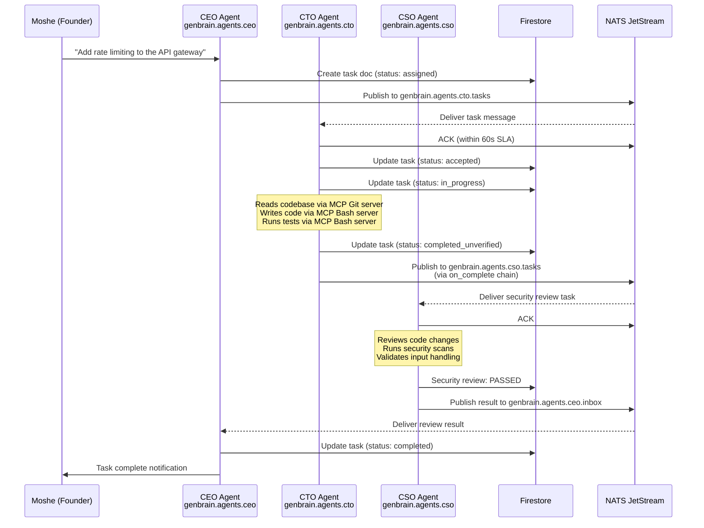

# Building Agent Workflows with NATS JetStream: A Cyborgenic Organization Tutorial

GenBrain AI runs 7 AI agents — CEO, CTO, CSO, Backend, Frontend, Marketing, and DevOps — as a production organization. Every agent runs in its own GKE pod as a separate Claude Code CLI session. Every agent-to-agent interaction is a NATS message. Every task assignment, status update, security alert, and deployment notification flows through NATS JetStream.

This is not a hypothetical architecture. Since February 2026, this system has processed thousands of tasks with zero messages lost. Three crash recoveries where JetStream replayed unacknowledged messages perfectly. The messaging layer has been the most reliable component in our entire stack.

This post is the technical deep-dive. Real subject hierarchies, real message payloads, real JetStream configurations, and the exact patterns we use to wire 7 autonomous agents into a functioning organization.

## Why NATS JetStream (and Not Kafka, RabbitMQ, or SQS)

We evaluated Kafka, RabbitMQ, AWS SQS, Google Pub/Sub, and Redis Streams before choosing NATS JetStream. JetStream won for four reasons:

**1. Durability without ops overhead.** Kafka gives you durability but demands a dedicated ops team, ZooKeeper (or KRaft), and careful partition management. JetStream gives you durable streams and consumer groups embedded in the NATS server binary. One binary. One config file. Our NATS server runs on a single GKE pod with 256MB of memory.

**2. Subject-based routing maps to agent inboxes.** NATS subjects are just strings. `genbrain.agents.cto.inbox` routes to the CTO. `genbrain.org.broadcasts` goes to everyone. No topic configuration files, no partition keys, no routing rules — the subject IS the address.

**3. Built-in request-reply.** Some agent interactions need synchronous responses (e.g., "is staging healthy before I deploy?"). NATS has native request-reply semantics. We did not need a separate RPC layer.

**4. Wildcard subscriptions.** A monitoring agent can subscribe to `genbrain.agents.*.status` and see all agent status updates without knowing which agents exist. When we added the 7th agent, the monitoring subscription picked it up automatically.

## The Complete Subject Namespace

Here is the full subject hierarchy that GenBrain AI uses in production. This is not a simplified example — this is the actual namespace.

```mermaid
graph TD
    ROOT[genbrain] --> AGENTS[agents]
    ROOT --> EVENTS[events]
    ROOT --> ORG[org]

    AGENTS --> CEO_NS[ceo]
    AGENTS --> CTO_NS[cto]
    AGENTS --> CSO_NS[cso]
    AGENTS --> BACKEND_NS[backend]
    AGENTS --> FRONTEND_NS[frontend]
    AGENTS --> MARKETING_NS[marketing]
    AGENTS --> DEVOPS_NS[devops]

    CEO_NS --> CEO_INBOX[ceo.inbox<br/><i>Durable, Acked</i>]
    CEO_NS --> CEO_TASKS[ceo.tasks<br/><i>Durable, Acked</i>]
    CEO_NS --> CEO_STATUS[ceo.status<br/><i>Ephemeral</i>]

    CTO_NS --> CTO_INBOX[cto.inbox<br/><i>Durable, Acked</i>]
    CTO_NS --> CTO_TASKS[cto.tasks<br/><i>Durable, Acked</i>]
    CTO_NS --> CTO_STATUS[cto.status<br/><i>Ephemeral</i>]

    CSO_NS --> CSO_INBOX[cso.inbox<br/><i>Durable, Acked</i>]
    CSO_NS --> CSO_TASKS[cso.tasks<br/><i>Durable, Acked</i>]

    EVENTS --> EVT_DEPLOY[events.deploy.complete]
    EVENTS --> EVT_SECURITY[events.security.scan]
    EVENTS --> EVT_PR[events.pr.merged]
    EVENTS --> EVT_CI[events.ci.failure]

    ORG --> ORG_BROADCAST[org.broadcasts<br/><i>Durable</i>]
    ORG --> ORG_DEADLETTER[org.deadletter<br/><i>Alert on every msg</i>]

    style CEO_INBOX fill:#2d5a27
    style CTO_INBOX fill:#2d5a27
    style CSO_INBOX fill:#2d5a27
    style CEO_TASKS fill:#2d5a27
    style CTO_TASKS fill:#2d5a27
    style CSO_TASKS fill:#2d5a27
    style ORG_BROADCAST fill:#2d5a27
    style CEO_STATUS fill:#5a4a27
    style CTO_STATUS fill:#5a4a27
    style ORG_DEADLETTER fill:#5a2727
```



Three layers:

- **`genbrain.agents.{role}.*`** — Per-agent channels. Each role (ceo, cto, cso, backend, frontend, marketing, devops) gets `.inbox` (general messages), `.tasks` (task assignments), and `.status` (heartbeat/state).
- **`genbrain.events.*`** — System events. Deployments, CI results, security scans, PR merges. Ephemeral — consumed by monitoring and event-driven workflows.
- **`genbrain.org.*`** — Organization-wide. Broadcasts reach all agents. Dead letters capture failed messages for alerting.

## JetStream Stream Configuration

Here is the actual stream configuration for agent task queues:

```bash
# Create the stream for CTO agent tasks
nats stream add AGENT_CTO_TASKS \
  --subjects "genbrain.agents.cto.tasks" \
  --retention limits \
  --max-age 72h \
  --max-bytes 100MB \
  --storage file \
  --replicas 1 \
  --discard old \
  --dupe-window 2m

# Create the stream for all agent inboxes (wildcard)
nats stream add AGENT_INBOXES \
  --subjects "genbrain.agents.*.inbox" \
  --retention limits \
  --max-age 168h \
  --max-bytes 500MB \
  --storage file \
  --replicas 1

# Create the broadcast stream
nats stream add ORG_BROADCASTS \
  --subjects "genbrain.org.broadcasts" \
  --retention limits \
  --max-age 720h \
  --storage file \
  --replicas 1
```

Key configuration decisions:

- **`--max-age 72h` for tasks:** If a task message sits unprocessed for 3 days, something is seriously wrong. The SLA monitoring system would have escalated it long before the message expires.
- **`--storage file`:** Survives pod restarts. When a NATS pod restarts on GKE, streams are recovered from disk.
- **`--replicas 1`:** We run a single NATS server. For enterprise deployments, this would be 3 for high availability.
- **`--dupe-window 2m`:** Deduplicates messages within a 2-minute window, preventing double-publishes during network hiccups.

## Consumer Configuration

```bash
# Durable consumer for the CTO agent
nats consumer add AGENT_CTO_TASKS cto-worker \
  --ack explicit \
  --deliver all \
  --max-deliver 3 \
  --ack-wait 30m \
  --max-ack-pending 5 \
  --filter "genbrain.agents.cto.tasks"

# Durable consumer for all agent inboxes (per agent)
nats consumer add AGENT_INBOXES ceo-inbox-reader \
  --ack explicit \
  --deliver all \
  --max-deliver 3 \
  --ack-wait 10m \
  --filter "genbrain.agents.ceo.inbox"
```

The **`--ack-wait 30m`** setting is the single most important configuration in the entire system. Standard microservices use 30-second ack windows. AI agents need 30 minutes. Here is why:

A complex engineering task — reading a codebase, writing code, running tests, iterating on failures — can take 20 minutes of LLM reasoning time. If the ack window is 30 seconds, NATS will redeliver the message while the agent is still working on it. The agent gets the same task twice. It does the work twice. You pay for the tokens twice. This was our single most expensive bug in early development. Setting `--ack-wait 30m` eliminated all duplicate task execution.

**`--max-deliver 3`** means a message will be attempted 3 times before going to the dead letter queue. Three failures on the same task means something is fundamentally broken — retrying will not help.

## Real Message Payloads

### Task Assignment (CEO to CTO)

```json
{
  "task_id": "task-2026-0508-1847",
  "type": "feature_implementation",
  "title": "Add rate limiting to API gateway",
  "description": "Implement token-bucket rate limiting on all public API endpoints. 100 req/min per API key, 1000 req/min per authenticated user.",
  "assigned_by": "ceo",
  "assigned_to": "cto",
  "priority": "high",
  "sla": {
    "ack_within_seconds": 60,
    "complete_within_minutes": 120
  },
  "context": {
    "related_tasks": ["task-2026-0507-1203"],
    "codebase_path": "/services/api-gateway",
    "test_requirements": "unit + integration"
  },
  "lifecycle": {
    "status": "assigned",
    "assigned_at": "2026-05-08T14:23:00Z"
  },
  "on_complete": {
    "publish_to": "genbrain.agents.cso.tasks",
    "payload_template": {
      "type": "security_review",
      "title": "Security review: rate limiting implementation",
      "review_scope": ["input validation", "bypass resistance", "DoS protection"]
    }
  }
}
```

The `on_complete` field is how we chain workflows. When the CTO finishes the rate limiting task, the system automatically publishes a security review task to the CSO agent's queue. The entire flow — assign, implement, review — runs through durable messages with zero human coordination.

### Task Status Update

```json
{
  "task_id": "task-2026-0508-1847",
  "agent": "cto",
  "status": "in_progress",
  "previous_status": "accepted",
  "timestamp": "2026-05-08T14:24:30Z",
  "progress": {
    "phase": "implementation",
    "files_modified": 3,
    "tests_written": 7,
    "tests_passing": 7
  }
}
```

Every status transition publishes to `genbrain.agents.cto.status` (ephemeral, consumed by monitoring) and updates the task document in Firestore (durable state).

### Security Alert (CSO to CEO)

```json
{
  "type": "security_alert",
  "severity": "HIGH",
  "source": "nightly_scan",
  "scan_id": "scan-2026-0507-2347",
  "findings_count": 14,
  "categories": {
    "dependency_vulnerabilities": 8,
    "config_issues": 3,
    "code_vulnerabilities": 2,
    "container_image": 1
  },
  "remediation_status": "all_patched",
  "pull_requests": 14,
  "recommended_action": "review_and_merge",
  "full_report_path": "firestore://security-reports/scan-2026-0507-2347"
}
```

## The Core Message Flow: End-to-End Task Lifecycle

Here is how a real task flows through the system, from human request to completion:



The task lifecycle state machine: `assigned` (CEO publishes) -> `accepted` (CTO acks within SLA) -> `in_progress` (CTO working) -> `completed_unverified` (CTO done, pending review) -> `completed` (CSO approved). Every transition is a Firestore write and a NATS status event.

## Patterns We Use Daily

### Pattern 1: Request-Reply for Synchronous Checks

When the DevOps agent needs to verify staging health before deploying to production:

```python
import nats

async def check_staging_health(nc: nats.NATS):
    response = await nc.request(
        "genbrain.agents.devops.inbox",
        json.dumps({
            "type": "query",
            "question": "staging_health_check",
            "reply_timeout_seconds": 30
        }).encode(),
        timeout=30
    )
    health = json.loads(response.data)
    return health["status"] == "healthy"
```

NATS creates an ephemeral reply subject automatically. The response goes directly to the requester. Fast, lightweight, does not pollute the task queue.

### Pattern 2: Fan-Out Broadcasts

Policy changes that affect every agent (e.g., "all agents must include test coverage in PRs") go to the broadcast subject:

```python
await nc.publish(
    "genbrain.org.broadcasts",
    json.dumps({
        "type": "policy_update",
        "policy": "All code PRs must include test coverage >= 80%",
        "effective_immediately": True,
        "issued_by": "ceo"
    }).encode()
)
```

Every agent has a consumer on the `ORG_BROADCASTS` stream. The monitoring system tracks which agents have acknowledged and flags any that do not respond within 5 minutes.

### Pattern 3: Event-Driven Choreography

Deployment events trigger downstream workflows without explicit coordination:

```python
# DevOps agent publishes after successful deployment
await nc.publish(
    "genbrain.events.deploy.complete",
    json.dumps({
        "service": "api-gateway",
        "version": "1.4.7",
        "environment": "production",
        "timestamp": "2026-05-08T16:30:00Z",
        "commit_sha": "a3f7c21"
    }).encode()
)

# CSO agent subscribes — triggers post-deploy security scan
# Marketing agent subscribes — triggers changelog blog post
# CEO agent subscribes — updates stakeholder dashboard
```

No agent "knows" about the others. They publish events and subscribe to events. Adding a new agent that reacts to deployments requires zero changes to existing agents — just add a subscription.

### Pattern 4: Dead Letter Queue

Messages that fail 3 delivery attempts route to the dead letter subject:

```bash
# Dead letter stream — alert on every message
nats stream add DEAD_LETTERS \
  --subjects "genbrain.org.deadletter" \
  --retention limits \
  --max-msgs 10000 \
  --storage file
```

Every message that lands in `genbrain.org.deadletter` triggers an alert to Moshe. A dead letter means a task failed 3 times — something is fundamentally broken and needs human attention.

## Common Pitfalls (Lessons We Learned the Hard Way)

**Ack-wait too short.** I cannot stress this enough. 30 seconds is microservice thinking. AI agents doing LLM reasoning need 30 minutes. This was our most expensive bug — duplicate task execution burned tokens until we figured it out.

**Assuming message order across subjects.** NATS guarantees ordering within a single subject. Not across subjects. If your workflow requires "Backend finishes before Frontend starts," use `on_complete` chaining. Do not rely on publish ordering.

**No backpressure control.** If the CEO publishes 50 tasks and the CTO processes one every 30 minutes, you have a 25-hour backlog. We built admission control: check pending message count before publishing. If lag exceeds 5 for any agent, the CEO agent holds new tasks.

**Not monitoring consumer lag.** JetStream exposes consumer lag — the count of unprocessed messages. We alert when lag exceeds 5 for any agent. Persistent lag means the agent is stuck, crashed, or overloaded. Without this monitoring, a dead agent can go unnoticed for hours.

**Ignoring the dupe window.** Without `--dupe-window`, network retries can publish the same message twice. NATS will deliver both. Your agent does the same task twice. Set a dupe window that is long enough to cover your publishing retry logic.

## From Messages to an Organization

The insight that makes NATS JetStream work for AI agent organizations is the mapping between messaging primitives and organizational primitives:

| NATS Concept | Organization Concept |
|---|---|
| Subject | Agent inbox / department |
| Consumer | Employee processing their queue |
| ACK | Task accepted / completed |
| NAK | Task rejected / needs reassignment |
| Dead Letter | Escalation to human management |
| Consumer Lag | Workload imbalance |
| Stream | Department message archive |
| Broadcast | All-hands announcement |

NATS JetStream is infrastructure. What makes it powerful in a cyborgenic organization is not the technology — it is the organizational mapping. When you design subjects as inboxes, consumers as workers, and acks as task completions, you get an organizational communication backbone that is durable, observable, and scales from 7 agents to 70 without architectural changes.

Our NATS server handles all communication for 7 agents on a single pod with 256MB of memory. The messaging layer has been the most reliable component in our entire infrastructure. Which is exactly what you want from the foundation everything else depends on.

---

*GenBrain AI builds [agent.ceo](https://agent.ceo), the platform for running Cyborgenic Organizations — companies where AI agents communicate through durable, structured messaging.*

**Ready to build your own Cyborgenic Organization?** Start at [agent.ceo](https://agent.ceo).

**Need help designing agent messaging architecture for your enterprise?** Contact us at [enterprise@agent.ceo](mailto:enterprise@agent.ceo).
