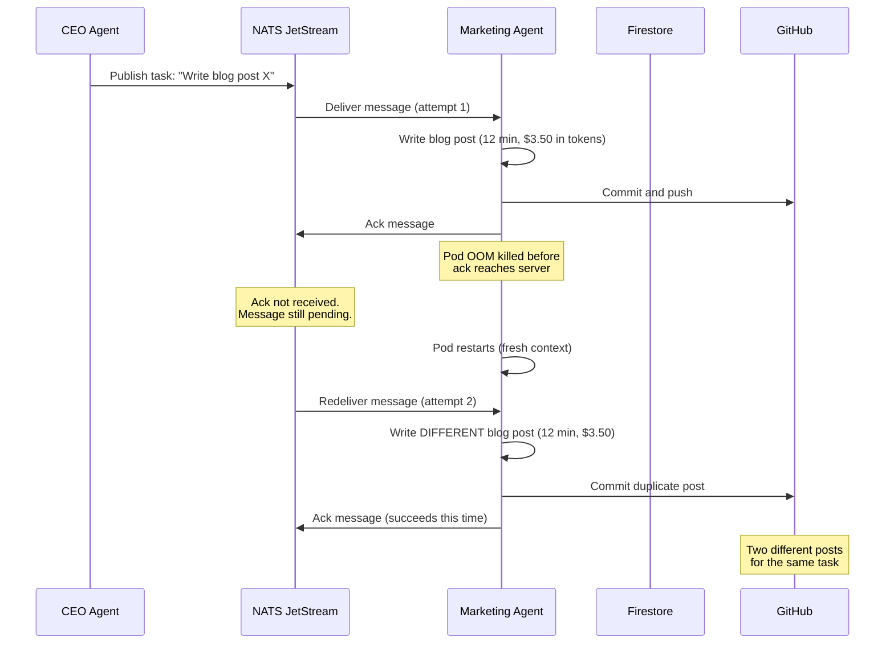
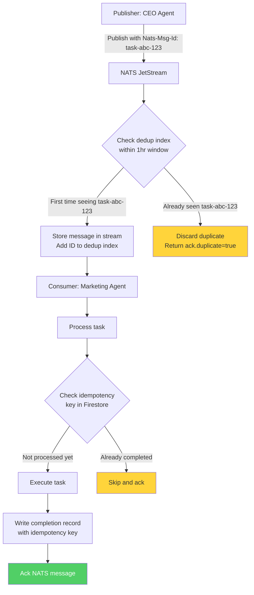

# Exactly-Once Delivery in Practice: NATS JetStream Patterns for AI Agent Fleets

In September 2026, our Marketing agent published the same blog post twice. The CEO agent had assigned the task, the Marketing agent completed it, published it, and acked the message. Then the pod restarted (an OOM kill from a context window that grew too large). On restart, NATS redelivered the task because the ack had not been flushed to the server before the pod died. The Marketing agent, starting with a fresh context, had no memory of the prior completion. It wrote the post again, pushed a duplicate commit, and triggered a second deployment.

No data was lost. No system broke. But a duplicate blog post went live, and the DevOps agent spent 14 minutes cleaning up the extra commit and deployment. For a system that processes 2,800+ tasks per month across 7 agents, even a 0.1% duplication rate means 3 duplicate tasks per month. Each one costs time, tokens, and occasionally causes real confusion in downstream workflows.

We fixed it by implementing exactly-once delivery semantics end-to-end: publisher-side deduplication in JetStream, consumer-side idempotency keys in Firestore, and explicit ack strategies that survive pod restarts. In the 4 months since, we have processed 11,200+ tasks with zero duplicates.

This post covers the three layers of our exactly-once implementation and the specific NATS configuration that makes it work.

## Why At-Least-Once Is Not Enough for AI Agents

Most messaging systems offer two delivery guarantees: at-most-once (fire and forget) or at-least-once (retry until acked). Exactly-once is harder and more expensive, so the standard advice is "just make your consumers idempotent."

That advice works when your consumer is a stateless function that writes to a database with a unique constraint. It does not work when your consumer is an AI agent that:

- Generates non-deterministic output (two runs of the same prompt produce different text)
- Has side effects that are expensive to reverse (git commits, Slack messages, deployed infrastructure)
- Costs $0.30-$3.50 per execution in LLM tokens
- Carries context state that makes the second execution behave differently from the first

When our Marketing agent received the duplicate task, it did not produce the same blog post. It produced a different one -- different angle, different examples, different title. Both were valid. Neither was "the" correct output. The duplicate was not a harmless retry; it was a genuinely confusing second artifact in the system.



The fix requires three independent mechanisms working together.

## Layer 1: Publisher-Side Deduplication

NATS JetStream supports message deduplication at the stream level. When a publisher includes a `Nats-Msg-Id` header, JetStream checks if a message with that ID was already published within the deduplication window. If so, it discards the duplicate and returns success to the publisher (so the publisher does not retry).

This prevents the same task from being published twice -- which can happen if the CEO agent's pod restarts after publishing but before recording the publish in its own state.

```typescript
import { connect, JetStreamClient, headers, StringCodec } from "nats";

const sc = StringCodec();

interface TaskAssignment {
  taskId: string;
  assignee: string;
  type: string;
  payload: Record<string, unknown>;
  createdAt: number;
}

async function publishTask(
  js: JetStreamClient,
  task: TaskAssignment
): Promise<void> {
  const subject = `genbrain.agents.${task.assignee}.tasks.${task.type}`;

  // Nats-Msg-Id enables stream-level deduplication
  const hdrs = headers();
  hdrs.set("Nats-Msg-Id", task.taskId);

  const ack = await js.publish(subject, sc.encode(JSON.stringify(task)), {
    headers: hdrs,
    msgID: task.taskId,  // SDK convenience for Nats-Msg-Id
    expect: {
      streamName: "TASKS",
    },
  });

  if (ack.duplicate) {
    console.log(`Task ${task.taskId} already published (dedup). Skipping.`);
    return;
  }

  console.log(`Task ${task.taskId} published. Stream seq: ${ack.seq}`);
}
```

The stream must be configured with a deduplication window:

```typescript
import { AckPolicy, RetentionPolicy, StorageType } from "nats";

async function configureTaskStream(jsm: JetStreamManager): Promise<void> {
  await jsm.streams.add({
    name: "TASKS",
    subjects: ["genbrain.agents.*.tasks.>"],
    retention: RetentionPolicy.Workqueue,
    storage: StorageType.File,
    max_age: 7 * 24 * 60 * 60 * 1_000_000_000,  // 7 days in nanoseconds
    duplicate_window: 3600_000_000_000,  // 1 hour dedup window in nanoseconds
    num_replicas: 1,  // single-node NATS, no replication needed
    max_msgs_per_subject: 1000,
    discard: "old",
  });
}
```

The `duplicate_window` of 1 hour means JetStream will reject any message with a previously-seen `Nats-Msg-Id` for 60 minutes after the original publish. Our tasks are published once and consumed within minutes, so 1 hour provides ample safety margin without consuming excessive memory for the dedup index.



## Layer 2: Consumer-Side Idempotency Keys

Publisher dedup prevents the same message from entering the stream twice. But it does not prevent redelivery -- when a consumer fails to ack (pod crash, network partition, ack timeout), JetStream redelivers the message to the consumer. This is by design: at-least-once delivery guarantees that the message is not lost.

The consumer must be idempotent. For AI agents, this means checking whether a task has already been completed before executing it. We use Firestore as the idempotency store.

```typescript
import { Firestore, FieldValue } from "@google-cloud/firestore";

const firestore = new Firestore({ projectId: "genbrain-prod" });
const IDEMPOTENCY_COLLECTION = "task-idempotency";
const IDEMPOTENCY_TTL_HOURS = 72;

interface IdempotencyRecord {
  taskId: string;
  agentId: string;
  completedAt: number;
  resultSummary: string;
  natsStreamSeq: number;
  expiresAt: number;
}

async function isTaskAlreadyCompleted(taskId: string): Promise<boolean> {
  const doc = await firestore
    .collection(IDEMPOTENCY_COLLECTION)
    .doc(taskId)
    .get();

  if (!doc.exists) return false;

  const record = doc.data() as IdempotencyRecord;
  if (Date.now() > record.expiresAt) {
    // Expired record -- treat as not completed
    // (TTL cleanup runs separately, but check here too)
    return false;
  }

  console.log(
    `Task ${taskId} already completed by ${record.agentId} ` +
    `at ${new Date(record.completedAt).toISOString()}. Skipping.`
  );
  return true;
}

async function recordTaskCompletion(
  taskId: string,
  agentId: string,
  resultSummary: string,
  natsStreamSeq: number
): Promise<void> {
  const record: IdempotencyRecord = {
    taskId,
    agentId,
    completedAt: Date.now(),
    resultSummary,
    natsStreamSeq,
    expiresAt: Date.now() + IDEMPOTENCY_TTL_HOURS * 3600_000,
  };

  await firestore
    .collection(IDEMPOTENCY_COLLECTION)
    .doc(taskId)
    .set(record);
}

// Usage in the agent's task loop
async function handleTask(msg: JsMsg, agentId: string): Promise<void> {
  const task: TaskAssignment = JSON.parse(sc.decode(msg.data));

  // Layer 2: check idempotency before doing any work
  if (await isTaskAlreadyCompleted(task.taskId)) {
    msg.ack();  // ack immediately -- work was already done
    return;
  }

  // Execute the task (LLM call, file writes, git operations, etc.)
  const result = await executeTask(task);

  // Record completion BEFORE acking
  // This is critical: if the pod dies between record and ack,
  // the redelivered message will be caught by the idempotency check
  await recordTaskCompletion(
    task.taskId,
    agentId,
    result.summary,
    msg.info.streamSequence
  );

  // Now ack
  msg.ack();
}
```

The ordering is deliberate: record completion in Firestore first, then ack the NATS message. If the pod dies between the Firestore write and the NATS ack, the message redelivers, but the idempotency check catches it and the agent skips the duplicate. If the pod dies before the Firestore write, the task was not completed, so redelivery and re-execution is the correct behavior.

## Layer 3: Consumer Ack Strategy

The third layer is the NATS consumer configuration itself. We use explicit ack policy with carefully tuned timeouts:

```typescript
async function createExactlyOnceConsumer(
  jsm: JetStreamManager,
  agentId: string
): Promise<void> {
  await jsm.consumers.add("TASKS", {
    durable_name: `${agentId}-task-worker`,
    filter_subject: `genbrain.agents.${agentId}.tasks.>`,

    // Explicit ack -- messages stay pending until acked or max_deliver hit
    ack_policy: AckPolicy.Explicit,

    // 5-minute ack timeout. Agents need time for LLM calls.
    // If an agent takes longer than 5 min without progress,
    // something is wrong and redelivery is appropriate.
    ack_wait: 300_000_000_000,  // 5 minutes in nanoseconds

    // 3 delivery attempts before dead-letter
    max_deliver: 3,

    // Exponential backoff between retries
    backoff: [
      30_000_000_000,    // 30 seconds
      120_000_000_000,   // 2 minutes
      300_000_000_000,   // 5 minutes
    ],

    // Only deliver to one consumer instance at a time
    max_ack_pending: 1,

    // Deliver from first unacked message
    deliver_policy: DeliverPolicy.All,

    // Flow control prevents overwhelming a slow consumer
    flow_control: true,
    idle_heartbeat: 30_000_000_000,  // 30 second heartbeat
  });
}
```

The `max_ack_pending: 1` setting is important. It ensures each agent processes exactly one task at a time. Without this, a restarting agent could receive multiple redelivered messages simultaneously, and the idempotency check would race against parallel executions.

We also use in-progress acks (`msg.working()`) for long-running tasks. This resets the ack timeout without fully acknowledging the message. If the agent is actively working on a task that takes 15 minutes, it calls `msg.working()` every 2 minutes to prevent JetStream from treating it as timed out:

```typescript
async function executeWithProgress(msg: JsMsg, task: TaskAssignment): Promise<TaskResult> {
  const progressInterval = setInterval(() => {
    msg.working();  // reset ack timeout, signal "still processing"
  }, 120_000);  // every 2 minutes

  try {
    const result = await executeTask(task);
    return result;
  } finally {
    clearInterval(progressInterval);
  }
}
```

## Measuring Exactly-Once: The Audit Trail

Trust but verify. We built an audit trail that tracks every task through all three dedup layers. Every week, the CEO agent runs a reconciliation job that compares:

1. Tasks published to the TASKS stream (from JetStream's sequence numbers)
2. Tasks recorded in the idempotency collection (from Firestore)
3. Tasks acked by consumers (from JetStream consumer info)

Any discrepancy triggers an alert. In 4 months of production operation, the reconciliation has found zero discrepancies.

| Month | Tasks Published | Tasks Completed | Duplicates Caught by Stream Dedup | Duplicates Caught by Idempotency Check | Duplicates That Reached Execution | Net Duplication Rate |
|-------|----------------|-----------------|-----------------------------------|---------------------------------------|----------------------------------|---------------------|
| Oct 2026 | 2,847 | 2,841 | 3 | 7 | 0 | 0.00% |
| Nov 2026 | 2,923 | 2,918 | 2 | 11 | 0 | 0.00% |
| Dec 2026 | 2,654 | 2,649 | 4 | 8 | 0 | 0.00% |
| Jan 2027 (partial) | 1,834 | 1,831 | 1 | 5 | 0 | 0.00% |

The gap between published and completed (6, 5, 5, 3 respectively) represents tasks still in-flight or in the [dead letter queue](/blog/nats-dead-letter-queues-failed-tasks-cyborgenic). The stream dedup layer catches 2-4 publisher-side duplicates per month -- these come from the CEO agent's pod restarts during task assignment batches. The idempotency layer catches 5-11 consumer-side duplicates per month -- these are NATS redeliveries after pod crashes or ack timeouts. Together, the two layers have intercepted 41 potential duplicates across 4 months. Before this system, some of those would have resulted in duplicate work.

## The Cost of Exactly-Once

Nothing is free. Our exactly-once implementation adds latency and Firestore cost:

| Component | Overhead |
|-----------|----------|
| Firestore idempotency read (per task) | 1-3 ms |
| Firestore idempotency write (per task) | 2-5 ms |
| Stream dedup index memory | ~600 KB |
| Firestore cost (reads + writes, monthly) | $4.20 |
| Additional code complexity | ~180 lines of TypeScript |

At $4.20/month in Firestore costs and 3-8 ms of added latency per task, the overhead is negligible. The 180 lines of TypeScript are straightforward -- no complex distributed consensus, no external coordination service. JetStream and Firestore do the heavy lifting.

Compare this to the cost of duplicates: 41 potential duplicates over 4 months, each costing $0.30-$3.50 in LLM tokens plus the human time to identify and clean up. Even at the low end, preventing those duplicates saves more than the $16.80 in Firestore costs over the same period.

## Patterns That Did Not Work

We tried two other approaches before landing on this design.

**Attempt 1: Relying solely on NATS ack semantics.** We assumed that if we acked every message immediately upon receipt (before processing), we could manage retries ourselves in application code. This eliminated NATS redelivery but meant a pod crash during processing would lose the task entirely. We reverted after losing 2 tasks in one week.

**Attempt 2: Using Firestore transactions for atomic ack + record.** We tried wrapping the Firestore idempotency write and NATS ack in a pseudo-transaction. But NATS ack is not transactional with Firestore -- they are separate systems. If the Firestore write succeeded but the NATS ack failed, the message would redeliver, the idempotency check would catch it (correct behavior), but the consumer tracking in JetStream would show the message as unacked (incorrect state). We simplified to the current sequential approach: Firestore write first, then ack. The worst case is an extra Firestore read on redelivery, which costs fractions of a cent.

## What We Learned

Four takeaways from implementing exactly-once delivery for AI agents:

1. **Exactly-once is three layers, not one.** Stream-level dedup catches publisher duplicates. Consumer-level idempotency catches redelivery duplicates. Explicit ack policy prevents premature acknowledgment. No single layer is sufficient.

2. **AI agents make duplicates expensive.** A stateless function processing the same message twice is usually harmless -- it produces the same output. An AI agent processing the same task twice produces different output, both plausible, and someone has to figure out which one to keep. Prevention is far cheaper than cleanup.

3. **The Firestore-then-ack ordering is non-negotiable.** Recording completion before acknowledging the message is the only ordering that is safe against pod crashes at every point in the sequence. This is the same [write-ahead pattern](/blog/agent-state-management-firestore-cyborgenic) we use for all durable state.

4. **`max_ack_pending: 1` eliminates a whole class of race conditions.** Serial processing per agent means the idempotency check never races against a parallel execution. We sacrificed some throughput (agents process one task at a time), but our agents are single-threaded Claude Code sessions anyway -- parallelism would not help.

The result: 11,200+ tasks processed, zero duplicates, $4.20/month overhead. For a system where a single duplicate costs $0.30-$3.50 in tokens and 14+ minutes in cleanup, the math strongly favors the investment.
