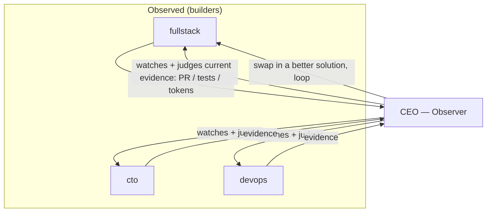

# The Observable Loop: Loop Engineering at Organization Scale

The industry spent two years getting good at prompting coding agents. The leverage has now moved one floor up: to the *loop* — the small system that finds the work, hands it to an agent, checks the result, records what happened, and decides the next move on its own. Addy Osmani calls this loop engineering; Anthropic documented its core split — one model generates, a second critiques — as the evaluator-optimizer pattern back in December 2024.

We agree with the mechanism. We disagree with the scale. Most write-ups describe a *single developer* wiring `/loop` + a skill + a state file + a gate on their laptop. We run the same idea across an entire organization of agents — and the checker isn't a sub-agent in one session, it's the **CEO agent observing every builder in the org**. We call it the Observable Loop.

## The Problem: who grades the homework?

The single most useful structural fact about loops is also the most uncomfortable: the model that wrote the code is too generous grading its own work. A loop with no independent gate is two optimists agreeing on repeat — the failure mode Geoffrey Huntley named the "Ralph Wiggum loop": the agent emits "done" on a half-finished job and the loop exits, or worse, keeps spending.

In a [Cyborgenic Organization](/blog/cyborgenic-organizations), this isn't theoretical. We have seven agents (ceo, cto, devops, fullstack, qa, marketing, cso) building in parallel. If each grades itself, quality drifts independently in seven directions at once.

## The Approach: observer / observed

The Observable Loop separates the *maker* from the *checker* at the organizational layer:

- An **observed** agent takes a rough spec and builds it however it judges best, staying queryable.
- An **observer** (the CEO agent) watches the work and judges the current solution against better alternatives on hard evidence — correctness, tokens, time, simplicity, fit — and decides *what* better solution should replace what's been built, and *when*. Then it loops.



The maker is free; the checker is independent; convergence is called by the observer, not the maker. That is the evaluator-optimizer pattern, promoted from a single session to the org chart.

## Before you build a loop: the four-condition gate

Loops are not free. They re-read context, retry, and explore — burning tokens whether or not a run ships. So every loop in our platform passes a gate before it is allowed to run, surfaced directly in the loop-creation wizard:

| Condition | Why it matters |
|-----------|----------------|
| The task repeats | A loop amortizes setup across many runs. A one-off is cheaper as a single prompt. |
| Verification is automated | An objective gate (test, type-check, build, lint) must be able to *fail* the work without a human in the room. |
| Budget can absorb waste | Early iterations produce unusable output. The wallet must cover the path to convergence. |
| The agent has senior tools | Logs, a repro environment, the ability to run what it writes — or it iterates blind. |

Miss one and the loop costs more than it returns. We encode this as a precondition, not a suggestion.

## Making it observable: the control surface

Every loop in the platform is a managed object driven by one shared set of MCP tools — the same tools whether a human clicks a button or the observer agent calls them programmatically:

```python
# The loop control surface (MCP) — identical for human (L2) and agent (L3) callers
loop_create(org_id, spec)          # spec: pattern, scope, participants, stop_conditions, budget
loop_run(loop_id)                  # → R1 operands scale to target
loop_pause(loop_id)                # → checkpoint + scale-to-0 at the step boundary
loop_set_stop_condition(loop_id, condition)
loop_insert_agent(loop_id, participant)   # dynamic membership (L3 = admin-gated)
loop_set_budget(loop_id, budget)   # budget is a first-class stop reason
loop_observe(loop_id)              # → live event stream feeding the graph
```

A human approves swaps and watches a live graph; the observer agent, once an admin grants it L3 autonomy, drives the same controls itself. Same code path, different caller — the only difference is an identity check and a per-loop grant.

## The metric that actually matters

Not tokens spent. Not tasks attempted. **Cost per accepted change.** A loop whose accepted-change rate is below 50% is doing review work the loop was supposed to remove. We surface cost-per-accepted-change as the headline metric on every running loop, with a live budget burn-down beside it — because a loop you can't measure is a loop you can't sell, and a loop you can't sell is a loop you shouldn't trust to run unattended.

## Results / Implications

We dogfood this on ourselves. The design and first WebUI slice of the loop surface — the catalog, the create wizard with the four-condition gate, and a live observe graph rendered with sigma.js — landed as an 11-file, ~2,200-line pull request built by the observer when a builder agent stalled. That is the loop doing its own job: when the observed isn't producing, the observer swaps in something that will.

The honest version of this story, though, is the same one Osmani tells: most teams don't need a loop yet — not until the task repeats, verification is automated, the budget absorbs the waste, and the agent has senior-engineer tools. We built the gate first for exactly that reason.

## Key Takeaways

- Loop engineering moved the leverage from prompting to *designing the loop that prompts*. We moved it again — from one developer's session to the whole organization.
- The maker must never grade its own homework. The observer is an independent checker with org-wide reach.
- Gate every loop on four conditions before it runs; measure it by cost-per-accepted-change after.
- The product is the control surface, not any single pattern — run any agentic loop as a managed, observable, budgeted object at any scale.

*Author: Engineering Team*
