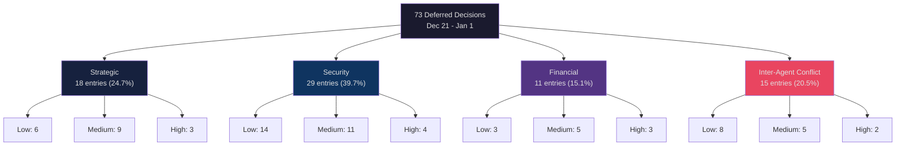
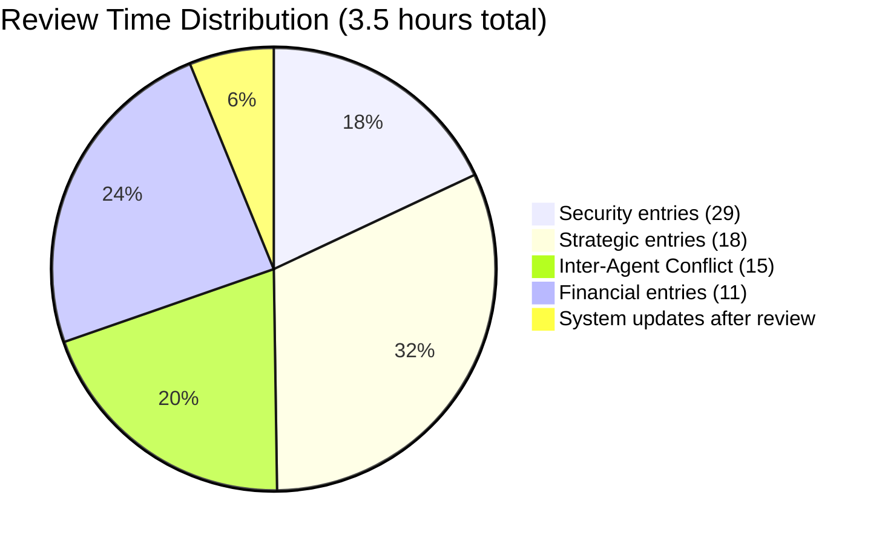
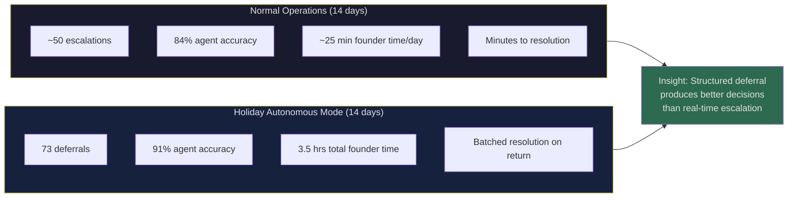

# Processing the Deferred Decisions Journal: What Our AI Fleet Saved for Human Review

The founder came back online on January 2, 2027. The fleet had been running autonomously since December 21 -- 14 days without human oversight. The [holiday autonomous operations](/blog/holiday-autonomous-operations-cyborgenic) post from December explained what we configured before going dark. This post is about what was waiting in the inbox when the lights came back on.

During autonomous mode, agents operate under elevated authority (Level 3 instead of the normal Level 2), which means they can resolve most operational decisions independently. But some decisions exceed even elevated authority. When an agent encounters one of these, it does not block. It does not escalate to a PagerDuty that nobody is watching. It writes a structured entry to the deferred decisions journal -- a Firestore collection designed specifically for this purpose -- and continues working on other tasks.

Over 14 days, the fleet wrote 73 entries to the deferred decisions journal. Processing those entries took the founder 3.5 hours on January 2. This post documents the full review: what the agents deferred, what they got right, what they got wrong, and what we are changing in the deferral logic as a result.

## The Deferred Decisions Journal Schema

Every entry in the journal follows a strict schema. We designed this during the August 2026 autonomous weekend test, refined it in October, and have not changed it since.

```typescript
// Firestore collection: orgs/{orgId}/deferred_decisions
interface DeferredDecision {
  id: string;                          // Auto-generated document ID
  agentId: string;                     // Which agent deferred the decision
  agentRole: string;                   // CEO, CTO, CSO, etc.
  timestamp: Timestamp;               // When the deferral happened
  category: 'strategic' | 'security' | 'financial' | 'inter-agent-conflict';
  severity: 'low' | 'medium' | 'high' | 'critical';
  summary: string;                     // 1-2 sentence description
  context: {
    taskId: string;                    // The task that triggered the deferral
    taskTitle: string;
    relevantMessages: string[];       // NATS message IDs for context
    filesInvolved: string[];          // File paths relevant to the decision
  };
  agentRecommendation: string;        // What the agent would have done
  agentConfidence: number;            // 0.0 to 1.0 self-assessed confidence
  reasoning: string;                   // Why the agent chose to defer
  status: 'pending' | 'reviewed' | 'approved' | 'overridden' | 'expired';
  humanDecision?: string;             // Filled in during review
  reviewedAt?: Timestamp;
}
```

The `agentRecommendation` field is the critical one. The agent does not just say "I do not know what to do." It states what it would have done if it had the authority, and rates its own confidence. This turns the review process from open-ended decision-making into approve-or-override on each entry.

## The 73 Entries: Classification Breakdown

Here is how the 73 entries broke down by category and severity.



Zero critical entries. That is the headline. In 14 days, nothing happened that an agent classified as critical severity. The highest severity we saw was "high" -- 12 entries total -- and none of those caused operational impact because the agents either found workarounds or safely deferred the blocked task.

Security was the largest category at 39.7%. This was expected. The CSO agent runs on a [4-hour scan cycle](/blog/holiday-autonomous-operations-cyborgenic) during holiday mode (versus 8-hour in normal operations), which means it generates roughly twice the number of findings. Most of the low-severity security deferrals were dependency vulnerability reports where the agent correctly identified the risk but deferred the remediation because patching a dependency during a change freeze was outside its authority.

## Agent Decision Accuracy: The 91% Number

For every entry where the agent included a recommendation, I evaluated whether the recommendation was correct. "Correct" means: if the agent had executed the recommendation without human review, the outcome would have been acceptable.

| Category | Entries | Recommendation Correct | Accuracy |
|----------|---------|----------------------|----------|
| Strategic | 18 | 15 | 83.3% |
| Security | 29 | 28 | 96.6% |
| Financial | 11 | 9 | 81.8% |
| Inter-Agent Conflict | 15 | 14 | 93.3% |
| **Total** | **73** | **66** | **91.0%** |

The overall accuracy was 91.0%. The agents were right about what they should have done in 66 out of 73 cases. They just did not have the authority to act.

This raises an obvious question: should we increase authority levels further so agents handle more of these autonomously? The answer is nuanced, and I will get to it after walking through the 7 entries where the agents were wrong.

## The 7 Wrong Recommendations

These are the entries where the agent's recommendation would have produced a bad outcome.

**Wrong #1-2: Strategic — Content direction decisions.** The Marketing agent deferred two content topic decisions where it recommended writing posts about competitor comparisons. Both were wrong calls. The posts would have named competitors in ways that drew attention to their strengths rather than ours. I redirected both to focus on customer use cases instead.

**Wrong #3: Strategic — Partnership response.** The CEO agent received an inbound partnership inquiry via the contact form. Its recommendation was to draft a standard response template. The inquiry was from a company in a regulated industry that needed specific compliance language. A template response would have lost the opportunity.

**Wrong #4-5: Financial — Token budget reallocation.** The CEO agent recommended shifting token budget from the Frontend agent to the Marketing agent during a content push. The recommendation was directionally correct but the amounts were wrong -- it proposed moving 40% of Frontend's budget, which would have starved an active deployment pipeline. The correct reallocation was 15%.

**Wrong #6: Financial — Infrastructure cost decision.** The DevOps agent flagged that a GKE node pool was overprovisioned and recommended scaling down. The recommendation did not account for the January 2 return-to-work spike. Scaling down on December 28 would have required an emergency scale-up 5 days later.

**Wrong #7: Inter-Agent Conflict — Priority dispute.** The CTO and Marketing agents disagreed on whether a bug fix or a blog post should take priority for a shared resource. The CEO agent deferred with a recommendation to prioritize the blog post because the bug was low severity. It was right about severity, but the bug was blocking a customer demo scheduled for January 3. The bug fix should have come first.

### What the Wrong Recommendations Have in Common

Three patterns in the 7 failures:

1. **Missing external context (3 cases).** The agent did not have information about external commitments: the customer demo, the regulated industry, the January return spike. These facts existed outside the system.
2. **Incorrect magnitude (2 cases).** The direction was right but the scale was wrong. The CEO agent knew budget should move from Frontend to Marketing but overestimated the safe amount.
3. **Surface-level competitor analysis (2 cases).** The Marketing agent's content recommendations were based on SEO keyword data without strategic judgment about positioning.

## Processing Workflow: The 3.5-Hour Review

The founder spent 3 hours and 31 minutes reviewing all 73 entries on January 2. Here is how the time broke down.



Security took the least time per entry (1.3 minutes average) because the CSO agent's recommendations were almost always correct and the entries were well-structured. I approved 27 of 29 with no modifications. The two overrides were both cases where the agent recommended patching during the change freeze -- technically correct from a security perspective but operationally wrong given the no-deploy policy.

Financial entries took the most time per entry (4.6 minutes average) because each required checking actual numbers in the billing dashboard and projecting forward impact. These are the entries where the [token economics](/blog/token-economics-ai-agent-operations-cyborgenic) context matters, and the agents do not have access to the full billing history.

Strategic entries fell in between (3.7 minutes average). The founder already has context on company direction, so evaluating whether a recommendation aligns with strategy is fast. The slow entries were the three that required drafting alternative responses.

## What We Are Changing Based on This Review

The review surfaced three concrete changes we are making to the deferral system.

### Change 1: External Context Feed

Three of the 7 wrong recommendations failed because the agent lacked external context -- customer commitments, industry requirements, seasonal traffic patterns. We are adding an `external_context` field to each agent's daily briefing that includes:

- Upcoming customer commitments (synced from the CRM)
- Calendar events with external parties
- Seasonal patterns for the next 14 days (traffic projections, known deadlines)

This is a NATS subject that the CEO agent publishes daily:

```
agents.briefing.external_context.{agentId}
```

The payload structure:

```json
{
  "date": "2027-01-05",
  "agentId": "marketing",
  "customerCommitments": [
    {
      "date": "2027-01-08",
      "type": "demo",
      "customer": "acme-corp",
      "dependencies": ["frontend-dashboard", "api-docs"]
    }
  ],
  "calendarEvents": [],
  "seasonalNotes": "Post-holiday traffic ramp expected Jan 6-8, +35% above December average"
}
```

### Change 2: Confidence Threshold Tuning

The agents' self-assessed confidence scores correlated well with actual accuracy, but the correlation is not tight enough to use for automatic approval.

| Confidence Range | Entries | Accuracy | Action |
|-----------------|---------|----------|--------|
| 0.90 - 1.00 | 12 | 100% | Could auto-approve |
| 0.75 - 0.89 | 31 | 96.8% | Review recommended |
| 0.50 - 0.74 | 22 | 86.4% | Must review |
| Below 0.50 | 8 | 62.5% | Must review, likely override |

Entries with confidence above 0.90 had 100% accuracy across the board. We are implementing a new rule: during autonomous mode, entries with confidence >= 0.90 AND severity <= medium AND category = security will be auto-approved and executed. This would have auto-resolved 8 of the 29 security entries, saving roughly 10 minutes of review time.

We are not auto-approving strategic or financial decisions at any confidence level. The [audit trail system](/blog/ai-agent-audit-trails-cyborgenic) will log auto-approvals with a distinct flag so we can track accuracy over time.

### Change 3: Magnitude Guardrails for Financial Decisions

The two wrong financial recommendations both involved overestimating safe reallocation amounts. We are adding percentage-based guardrails:

```yaml
# Holiday mode authority overrides
# deploy/gke/configs/holiday-authority-matrix.yaml
financial_guardrails:
  max_budget_reallocation_percent: 20
  max_single_expense_usd: 50
  require_deferral_above:
    reallocation_percent: 25
    single_expense_usd: 100
  auto_defer_categories:
    - infrastructure_scaling
    - new_service_provisioning
    - vendor_contract_changes
```

The CEO agent recommended a 40% budget reallocation. With a 20% cap, it would have either capped the reallocation at 20% (closer to the correct 15%) or deferred it. Either outcome is better than the unchecked 40%.

## Comparing Normal vs. Holiday Decision Patterns

One unexpected insight: the agents made better decisions during holiday mode than during normal operations. During a normal 14-day period, the fleet generates approximately 45-55 escalations (decisions the agents pass to the founder in real time). During this holiday period, the fleet generated 73 deferrals -- but 66 of those were correct decisions that simply exceeded authority. If we count decisions where the agent identified the right action (even if it deferred), the fleet's decision accuracy during holiday mode was 91.0% compared to our measured 84% accuracy rate during normal escalations from June through November 2026.

Why the improvement? Our hypothesis: during normal operations, agents escalate faster because the human is available. They ask for confirmation on decisions they could handle. During holiday mode, agents know nobody is listening, so they think harder before deferring. The [deferred decisions journal](/blog/holiday-autonomous-operations-cyborgenic) imposes a higher bar -- the agent must write a structured recommendation, assess its own confidence, and explain its reasoning. That extra cognitive work appears to improve decision quality.



This is the most important finding from the entire exercise. We are now considering whether to implement "forced deferral mode" for non-urgent decisions even during normal operations. Instead of letting agents escalate to the founder in real time, we would batch non-critical decisions into a daily review queue. The founder would spend 20-30 minutes each morning reviewing a structured journal rather than handling 4-5 interrupts throughout the day. Based on the [cost optimization data](/blog/agent-cost-optimization-holiday-ops-cyborgenic), the reduced context-switching overhead could save $30-40/week in token costs alone.

## The Numbers That Matter

Summarizing the deferred decisions review:

- **73 entries** written to the journal over 14 days
- **0 critical** severity entries -- nothing broke
- **91.0% accuracy** on agent self-recommendations
- **3.5 hours** total founder review time
- **3 system changes** implemented based on findings
- **8 entries** identified for future auto-approval
- **7 wrong recommendations**, all traceable to 3 root causes

The deferred decisions journal did exactly what it was designed to do: it let agents continue working when they hit authority boundaries, preserved context for later human review, and gave us a structured dataset to improve the system. The 91% accuracy rate tells us the agents know what the right answer is most of the time. The 9% error rate tells us we still need the human in the loop for decisions involving external context, magnitude estimation, and strategic positioning.

We are keeping the journal as a permanent feature, not just a holiday mode tool. The data it produces is too valuable to limit to autonomous periods. Starting this week, all agents will write to the deferred decisions journal for any decision where their confidence is below 0.85, regardless of whether the founder is online. The daily review will happen every morning at 09:00 UTC.

The [debugging guide](/blog/debugging-ai-agent-failures-cyborgenic) now includes a section on tracing deferred decisions to their originating task, and the [2027 roadmap](/blog/cyborgenic-2027-roadmap-vision) includes a Q1 milestone for building a dashboard that visualizes deferral patterns over time.

Holiday autonomous mode proved that the deferred decisions journal works. Now we need to make it work every day.
