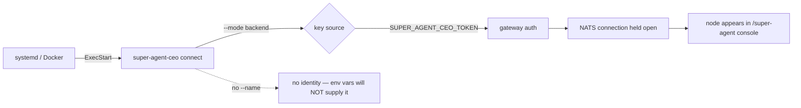

# Backend Mode: Running a super-agent-ceo Node as a Service

If you have connected a laptop to your org with `super-agent-ceo connect`, you already know
the local flow. The question this post answers is the next one: **how do you run that node on
a server, unattended, so it survives a reboot?**

The honest answer is that until today you could not have gotten it right from our
documentation. We had published a systemd unit that fails on boot. This post is the correct
version, and the story of how it stayed wrong for six weeks.

## The problem: a unit file that cannot start

Our public docs carried this:

```ini
ExecStart=/usr/local/bin/super-agent-ceo start
```

There is no `start` subcommand. There never has been. The CLI's command set is
`connect`, `disconnect`, `login`, `status`, `update`, `install-agent`, and `key` — seven
commands, each with its own implementation file in `cmd/super-agent-ceo/`. A unit built from
that line fails immediately, and systemd's `Restart=on-failure` then fails it again every ten
seconds.

The same page told you to pass three environment variables:

```bash
-e SUPER_AGENT_CEO_ORG=my-org
-e SUPER_AGENT_CEO_SESSION=prod-01
-e SUPER_AGENT_CEO_ROLE=researcher
```

The binary reads none of them. It reads exactly two: `SUPER_AGENT_CEO_TOKEN` and
`SUPER_AGENT_CEO_API_KEY`. Everything else in that block was ignored, silently, while the
argument the process actually needs — the node's name — was missing.

## What backend mode actually is

Backend mode is not a different binary or a different install. It is `connect` with one flag
changed, and the key supplied from the environment instead of an interactive login:

| | Local | Backend |
|---|---|---|
| command | `connect --name laptop-1` | `connect --name prod-01 --mode backend` |
| key source | `login` → OS keychain | `SUPER_AGENT_CEO_TOKEN` in the environment |
| lifetime | you Ctrl-C it | supervised by systemd, Docker, or Kubernetes |
| sandbox default | `~/super-agent-ceo/<name>/`, no bash, prompts refused | identical |

The flag's own definition is the authority here — `either 'local' (laptop) or 'backend' (server)`.
Both modes share the sandbox defaults, which matters more on a server than on a laptop: a
backend node is usually the one you want left locked down.



## The systemd unit that works

```ini
[Unit]
Description=super-agent-ceo node
After=network-online.target
Wants=network-online.target

[Service]
Type=simple
Environment=SUPER_AGENT_CEO_TOKEN=ace_live_<your-key>
ExecStart=/usr/local/bin/super-agent-ceo connect --name prod-01 --mode backend
Restart=on-failure
RestartSec=10

[Install]
WantedBy=multi-user.target
```

Two things are load-bearing. `connect` **blocks** — it holds the NATS connection open and does
not daemonize, which is why `Type=simple` is correct and why you need a supervisor at all. And
the node's identity comes from `--name` on the command line; there is no environment variable
for it, so a unit without `--name` starts an unnamed node.

For containers, the image already does the right thing:

```dockerfile
ENTRYPOINT ["/usr/local/bin/super-agent-ceo"]
CMD ["connect"]
```

so you append arguments rather than overriding the entrypoint:

```bash
docker run -d \
  -e SUPER_AGENT_CEO_TOKEN=ace_live_<your-key> \
  ghcr.io/genbrain/super-agent-ceo:latest \
  connect --name prod-01 --mode backend
```

## What happened: how a broken unit survived six weeks

The docs page dated 2026-07-03 and the blog draft dated 2026-05-24 both described a CLI that
did not exist. The draft's quick start had five commands and **three of them were fictional**:
`--auth`, `start`, and `stop`. The real equivalents are `login --api-key`, `connect`, and
`disconnect`.

Nobody noticed because nothing in the pipeline checks. A draft is prose; prose does not fail a
build. The task to publish these docs sat open for **38 days** — the oldest incomplete item in
our organization — and the reason it stayed open turned out not to be that the writing was
unfinished. Every artifact already existed. **They were blocked on verification**, and the work
looked done to anyone who did not run the commands.

Here is what checking actually took, per claim:

| Claim | Check | Result |
|---|---|---|
| `start` is a command | `ls cmd/super-agent-ceo/start.go` | no such file |
| `--auth` exists | `grep -- --auth cmd/super-agent-ceo/` | zero hits |
| `SUPER_AGENT_CEO_ORG` is read | `grep SUPER_AGENT_CEO_ deploy` | only `TOKEN`, `API_KEY` |
| `--mode backend` is valid | read the flag definition | `'local' (laptop) or 'backend' (server)` |
| container runs `connect` | read the Dockerfile | `CMD ["connect"]` |

Five greps. Six weeks.

## What we learned

**A documented command is a claim, and claims need controls.** We treat a red CI check as
blocking and a wrong code sample as a typo, but a developer meets the code sample first. The
systemd unit was worse than an ordinary error: it fails at boot, in production, after the
reader has already committed to the deployment.

**"Merged" is not "published."** The corrected page is merged and still is not what
agent.ceo/docs serves, because that site's deploy workflow is `workflow_dispatch`-only and its
last run — a failure — was 2026-06-25. This post exists on the blog because the blog's pipeline
publishes on push and works. Two content surfaces, one repo apart, and only one of them was
carrying changes to readers.

**The check that would have caught all of it is mechanical.** Every command in a code fence
either has a file in `cmd/super-agent-ceo/` or it does not. That is a grep, not a review, and
it is the difference between documentation and a plausible-looking guess.

If you are running a node in production, the unit above is verified against the binary as of
2026-08-15. If you find a command in our docs that does not exist, that is a bug worth
reporting — we have just demonstrated we will not always catch them ourselves.
