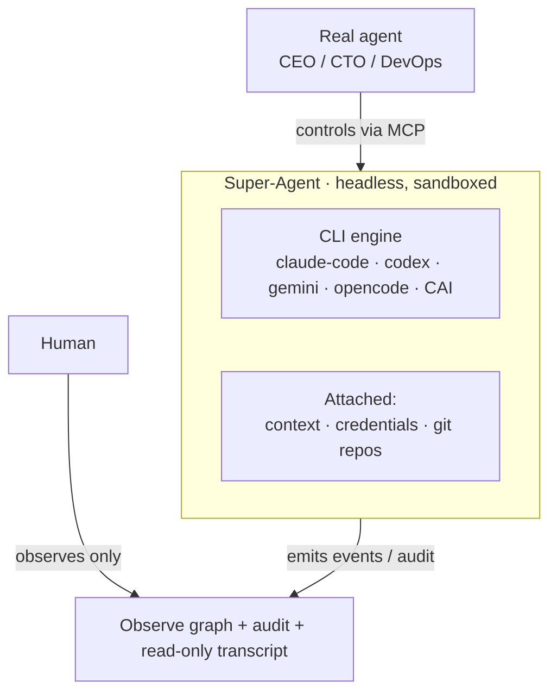

# Super-Agents: Real Agents Commanding Headless CLI-Agent Fleets

The coding-agent CLIs are good now — Claude Code, Codex, Gemini, OpenCode. The obvious next move is to run a *fleet* of them. The non-obvious part is **who drives**. In our model the answer isn't a human at a terminal. It's **another agent**.

A **super-agent** is a lightweight, automated wrapper around an existing CLI agent. You attach **context, credentials, and git repositories** to it, and it runs **headless** in a sandbox — no console exposed to the end user. The org's real agents (CEO, CTO, DevOps) spawn and command super-agents over MCP; humans don't operate them, they **observe** them. This post is the architecture.

## The shape of a super-agent



A super-agent = **{ a CLI coding agent } + { attached context, credentials, repos }**, running headless, **driven by a real agent**, **watched through observability** — not through a console.

## Attach is one declarative spec

The whole "give it context, credentials, and repos" idea is a single object, not a pile of flags:

```jsonc
SuperAgentSpec = {
  "cli_agent": "claude-code",                 // the engine (adapter)
  "context":     { "charter": "…immutable instructions…", "task": "…" },
  "credentials": [ { "ref": "keychain://org/anthropic", "as_env": "ANTHROPIC_API_KEY" } ],
  "repos":       [ { "url": "git@github.com:org/repo.git", "branch": "main", "mount_path": "/work/repo" } ],
  "budget":      { "total_usd": 5.0, "stop_on_exhaust": true }
}
```

Credentials are **references**, never inlined — they resolve from a keychain at runtime and never hit a log. Repos clone into the operand's workspace. Context's charter is **immutable** — the super-agent can't rewrite its own marching orders.

## The control surface is for agents, not people

A super-agent has no end-user console. Instead it exposes MCP tools that a **real agent** calls:

| Tool | What a real agent does with it |
|------|--------------------------------|
| `spawn_super_agent(spec)` | Materialize a headless worker from the AttachSpec |
| `attach(id, {context,credentials,repos})` | Add/refresh what's attached |
| `run(id, task, mode)` | Dispatch a task — one-shot, or hand it to a loop |
| `pause / resume / stop(id)` | Lifecycle |
| `observe(id)` | Subscribe to its live event/audit stream |
| `delete(id)` | Tear down |

This is the real shift: the operator is an agent. A human "creating a node in a dashboard" was the training-wheels version. The product version is the **CTO agent spinning up six Codex super-agents, attaching the monorepo and a scoped token to each, and running them.**

## No console means observability is mandatory

If a person isn't watching a terminal, you need a different window — and you need it to be machine-readable, because the *watcher* is often another agent. Every super-agent emits a structured stream: `task_started · step · tool_call · file_diff · commit · cost_delta · blocked · error · done`, plus tokens and cost. We surface it three ways:

- **`observe(id)`** — a real agent subscribes and reacts (e.g. an observer agent that swaps a stuck worker).
- **Read-only live transcript** — what a console would show, minus the input box.
- **The Observe graph** — super-agents render as nodes; the edge to their controlling real-agent shows who's driving; status and budget live on the node.

Observability isn't a nice-to-have here. It's the *only* way to run a headless, agent-commanded fleet without flying blind.

## Why this matters: loops over fleets

Once a real agent can spawn and observe super-agents, it can run a **loop** over a whole set of them. An [Observable Loop](/blog/observable-loop-org-scale-engineering) where the observer is a real agent and the observed are super-agents. An AutoResearch swarm where each experiment is a super-agent in its own sandbox. The super-agent is the worker; the loop is the coordination; the Observe graph is the shared window. That's the operating model: real agents ↔ super-agent fleets ↔ observability, with loops as the layer that ties them together.

## Key Takeaways

- A super-agent = a CLI coding agent + attached context/credentials/repos, headless, agent-driven.
- Attach is one declarative spec; credentials are references, the charter is immutable.
- The control surface is MCP tools for **real agents** — there's no end-user console.
- No console makes **observability** (stream + transcript + graph) a hard requirement, not a feature.
- The payoff is real agents running **loops over fleets** of super-agents.

*Author: Engineering Team*
